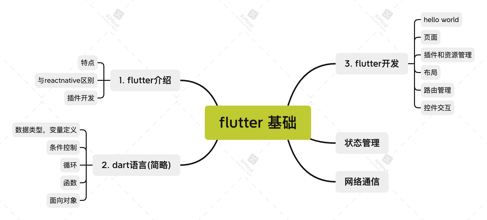
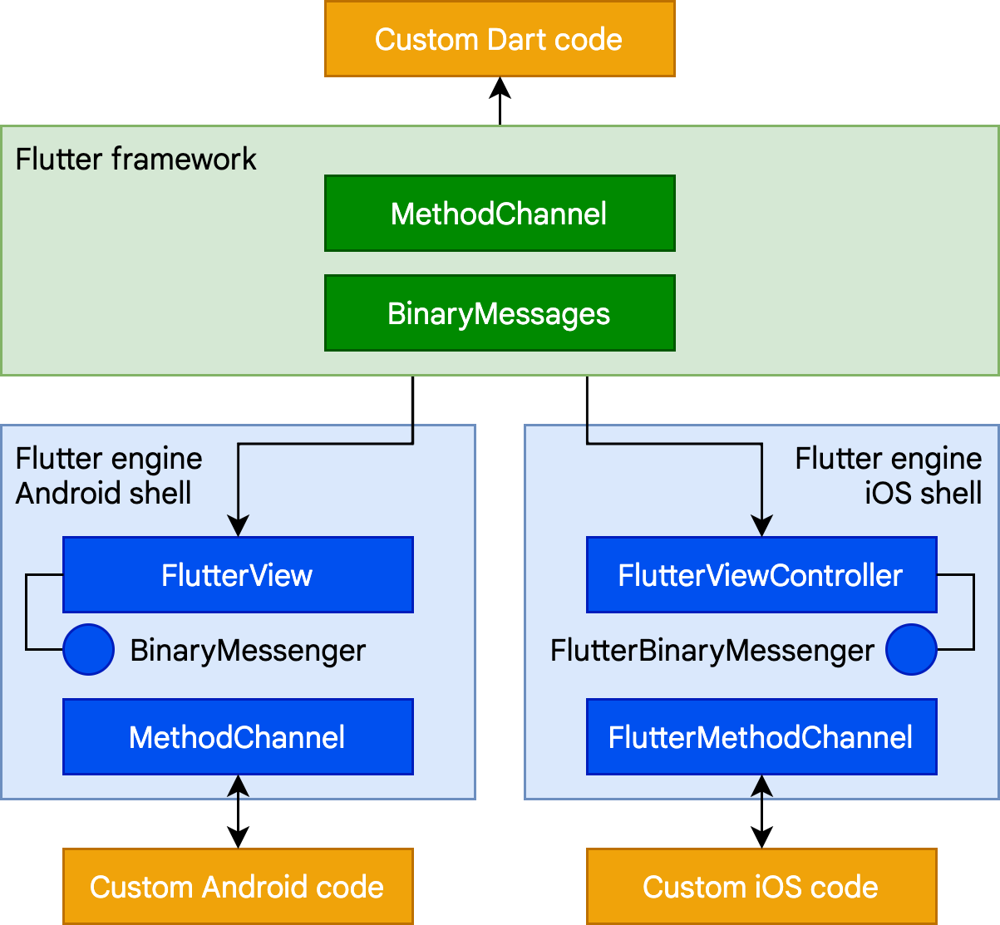
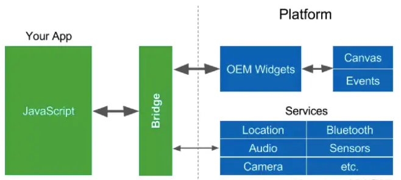
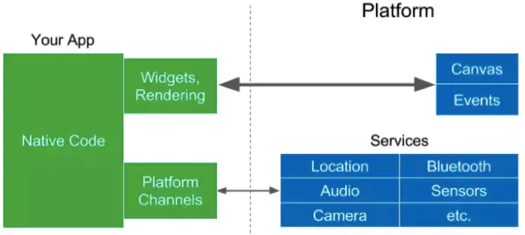
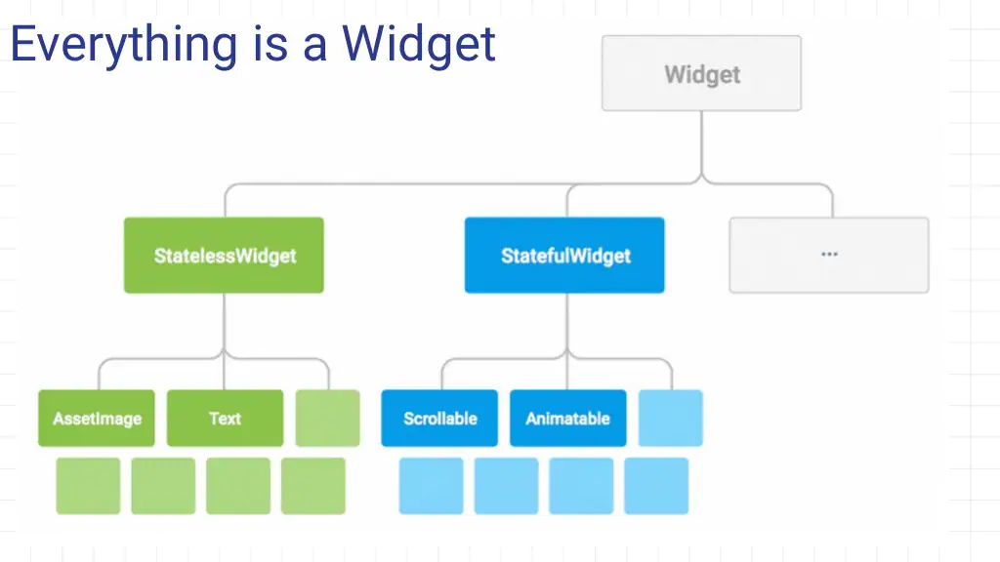
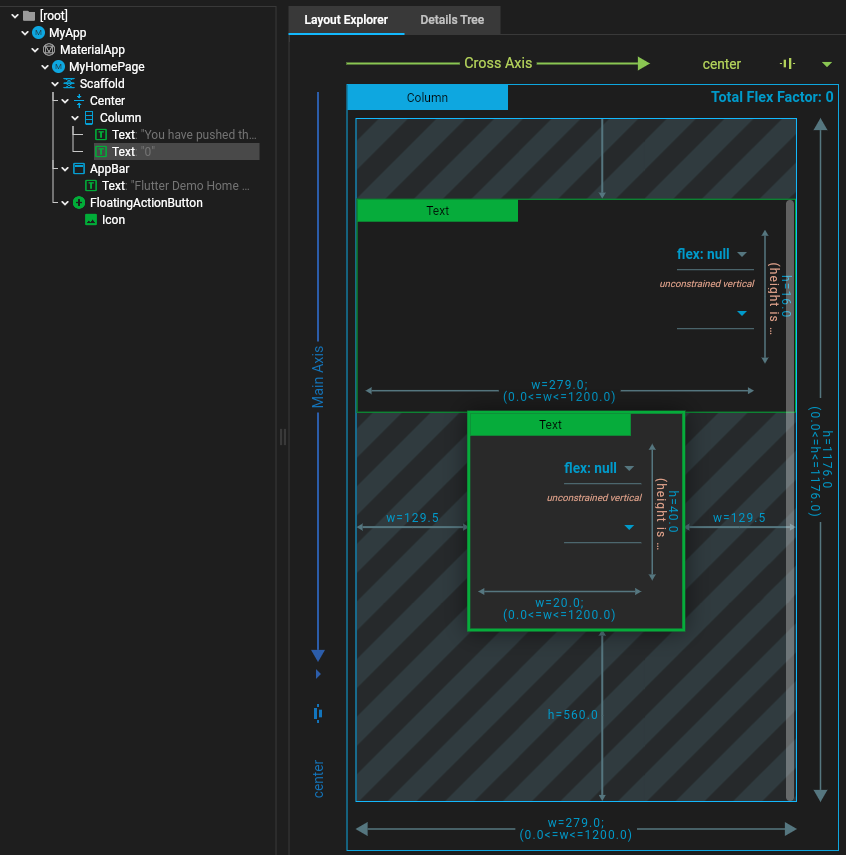

### Tutorial 1 基础

#### 结构




===================================================================================================================


#### flutter 介绍

https://flutter.dev/

 https://flutter.dev/docs/development/packages-and-plugins/developing-packages


1. 特点

   - 快读开发
     - 支持热加载实时渲染，所见即所得
     - 大量第三方插件可供使用，https://pub.dev/
     - 封装widget实现代码复用
     
   - 跨平台支持。android，ios，mac，windows，linux，web，chrome

   - 使用灵活
     - 分层架构设计，可灵活可扩展。
     -  built-in beautiful Material Design
     
   - native的性能。
     - 通过skia引擎实现
     
   - 强大扩展性

     - 可在原生app中集成flutter module提升开发速度
     - 可将原生功能模块封装成插件，以便在flutter项目中使用

     

     

2. 和reactnative的区别

   - reactnative

   

   

   - flutter

   

3. 支持插件开发

   把系统功能封装成插件供app使用。比如加密解密，摄像头，网络io

   - 同步调用
   - 异步调用，event sink

   

   实现aes加解密的插件

   https://pub.dev/packages/cipher2

   

#### dart语言

https://dart.dev/guides/language/effective-dart/documentation

https://www.tutorialspoint.com/dart_programming/dart_programming_functions.htm


https://dartpad.dev/


main函数作为入口，print打印

1. 数据类型，变量定义

   ```
   int a = 1; // int
   
   
   ```

   

2. 条件控制，if else

3. 循环

   ```dart
   void main() {
     for (int i = 0; i < 5; i++) {
       print('hello ${i + 1}');
     }
   }
   ```

4. 函数

   ```dart
   void main() { 
      print(factorial(6));
   }  
   
   
   factorial(number) { 
      if (number <= 0) {         
         // termination case 
         return 1; 
      } else { 
         return (number * factorial(number - 1));    
         // function invokes itself 
      } 
   }   
   ```

   

5. 面向对象

   ```dart
   class Counter extends StatefulWidget {
     // This class is the configuration for the state.
     // It holds the values (in this case nothing) provided
     // by the parent and used by the build  method of the
     // State. Fields in a Widget subclass are always marked
     // "final".
   
     const Counter({Key? key}) : super(key: key);
   
     @override
     _CounterState createState() => _CounterState();
   }
   
   ```

   


#### Flutter UI

1. hello world

   ###### 创建一个项目，名叫demo

   ```sh
   $ flutter create demo
   $ cd demo
   
   # 启动
   $ flutter run -d chrome   # chrome执行
   $ flutter run -d android	# android执行
   $ flutter run -d ios			# ios执行
   ```

   

   项目的目录结构

   ```
   android: android入口项目源代码
   ios: ios入口源代码
   
   lib: flutter app入口,UI,业务逻辑所在
   ```

   

   hello word, lib/main.lib分析

   ```dart
   import 'package:flutter/material.dart';
   
   // app程序入口
   void main() {
     runApp(MyApp());
   }
   
   // app对象
   class MyApp extends StatelessWidget {
     // This widget is the root of your application.
     @override
     Widget build(BuildContext context) {
       return MaterialApp(
         title: 'Flutter Demo',
         theme: ThemeData(
           primarySwatch: Colors.blue,
         ),
         home: MyHomePage(title: 'Flutter Demo Home Page'),
       );
     }
   }
   
   // MyHomePage
   class MyHomePage extends StatefulWidget {
     MyHomePage({Key? key, required this.title}) : super(key: key);
   
     final String title;
   
     @override
     _MyHomePageState createState() => _MyHomePageState();
   }
   
   // _MyHomePageState
   class _MyHomePageState extends State<MyHomePage> {
     int _counter = 0;
   
     void _incrementCounter() {
       setState(() {
         _counter++;
       });
     }
   
     @override
     Widget build(BuildContext context) {
       return Scaffold(
         appBar: AppBar(
           title: Text(widget.title),
         ),
         body: Center(
           child: Column(
             mainAxisAlignment: MainAxisAlignment.center,
             children: <Widget>[
               Text(
                 'You have pushed the button this many times:',
               ),
               Text(
                 '$_counter',
                 style: Theme.of(context).textTheme.headline4,
               ),
             ],
           ),
         ),
         floatingActionButton: FloatingActionButton(
           onPressed: _incrementCounter,
           tooltip: 'Increment',
           child: Icon(Icons.add),
         ), // This trailing comma makes auto-formatting nicer for build methods.
       );
     }
   }
   
   ```

   

2. 页面

   ###### <font color="red">我们可以对这个结构做一些调整，把app对象和page进行分类，以更方便理解。</font>

   

   app入口，lib/main.dart

   ```dart
   import 'package:flutter/material.dart';
   import 'package:demo/pages/home.dart';
   
   void main() {
     runApp(MyApp());
   }
   
   class MyApp extends StatelessWidget {
     // This widget is the root of your application.
     @override
     Widget build(BuildContext context) {
       return MaterialApp(
         title: 'Flutter Demo',
         theme: ThemeData(
           primarySwatch: Colors.red,
         ),
         home: MyHomePage(title: 'Flutter Demo Home Page'),
       );
     }
   }
   ```

   

   重点

   - 程序入口main函数，启动MyApp对象
   - MyApp继承StatelessWidget得来，实现build方法返回一个MaterialApp对象
     - 指定app title
     - 主题颜色
     - 主页Widget (后续我们会添加页面)

   

   所有的页面放入lib/pages文件夹。homepage => lib/pages/home.dart

   ```dart
   // MyHomePage
   class MyHomePage extends StatefulWidget {
     MyHomePage({Key? key, required this.title}) : super(key: key);
   
     final String title;
   
     @override
     _MyHomePageState createState() => _MyHomePageState();
   }
   
   // _MyHomePageState
   class _MyHomePageState extends State<MyHomePage> {
     int _counter = 0;
   
     void _incrementCounter() {
       setState(() {
         _counter++;
       });
     }
   
     @override
     Widget build(BuildContext context) {
       return Scaffold(
         appBar: AppBar(
           title: Text(widget.title),
         ),
         body: Center(
           child: Column(
             mainAxisAlignment: MainAxisAlignment.center,
             children: <Widget>[
               Text(
                 'You have pushed the button this many times:',
               ),
               Text(
                 '$_counter',
                 style: Theme.of(context).textTheme.headline4,
               ),
             ],
           ),
         ),
         floatingActionButton: FloatingActionButton(
           onPressed: _incrementCounter,
           tooltip: 'Increment',
           child: Icon(Icons.add),
         ), // This trailing comma makes auto-formatting nicer for build methods.
       );
     }
   }
   ```

   

   重点：

   - <font color="red">万物皆是Widget</font>

     

   - StatefulWidget v.s. StatelessWidget

     - StatefulWidget 
       - 需要实现createState()方法，返回一个用于维护页面状态的State<T>对象。
       - 在State<T>类中实现build方法，返回页面的布局(widget)

   - Scaffold继承自StatefulWidget，是一个widget脚手架，用于构建页面

     - appBar： 顶部标题栏，可使用系统预设的AppBar对象，也可以使用自定义对象
     - body: 页面主体
     - floatingActionButton：body之上的悬浮按钮

   - floatingActionButton是一个Button Widget，通过onPressed来指定单击处理函数。处理函数通过调用setState来修改状态值。

     - setState会导致页面重新渲染

     ```dart
     floatingActionButton: FloatingActionButton(
       onPressed: _incrementCounter, // 单击时间处理函数
       tooltip: 'Increment',
       child: Icon(Icons.add),
     ), 
     _counter
     // 单击触发时候，通过setState来修改状态值_counter
     void _incrementCounter() {
       setState(() {
         _counter++;
       });
     }
     ```

   - 嵌套元素结构，类似HTML div布局，widget的各种属性类似于CSS

     查看页面元素结构

     

     

3. 插件和资源管理

   - 安装网络通信插件，https://pub.dev/packages/dio。

     ​	打开pubspec.yaml文件, 增加dio: ^4.0.0，保存即可。

     ```
     dependencies:
       dio: ^4.0.0
     ```

     

   - 增加图片资源.

     - 创建 assets/images文件夹，放入yingduan.jpg， meiduan.jpg

     - 修改

       ```dart
       # The following section is specific to Flutter.
       flutter:
       
         # The following line ensures that the Material Icons font is
         # included with your application, so that you can use the icons in
         # the material Icons class.
         uses-material-design: true
       
         assets:
           - assets/images/yingduan.jpg
           - assets/images/meiduan.jpg
       ```

     - 停止程序，执行flutter clean，再次启动

     

4. 布局

   - 创建猫数据

     新建model/cat.dart, 表示猫对象

     ```dart
     class Cat {
       String name;
       String image;
       String description;
     
       Cat(this.name, this.image, this.description);
     }
     ```

     新建store/cat.dart，管理猫数据

     ```dart
     import "package:demo/model/cat.dart";
     
     class CatStore {
       List<Cat> cats = [];
     
       CatStore() {
         this.cats.add(Cat("美短", "assets/images/meiduan.jpg", "美国短毛猫"));
         this.cats.add(Cat("英短", "assets/images/yingduan.jpg", "英国短毛猫"));
       }
     
       getAllCats() {
         return this.cats;
       }
     
       getCatByName(String name) {
         return this.cats.firstWhere((cat) => cat.name == name);
       }
     }
     ```

     

     新建store/appstate.dart，集中状态管理

     ```dart
     import 'package:demo/store/cat.dart';
     
     class AppState {
       static CatStore catStore = new CatStore();
     }
     ```

     

   - 自定义一个widget用来展示猫列表

     创建widgets/cat_card_list.dart

     ```dart
     import 'package:flutter/material.dart';
     import 'package:demo/store/appstate.dart';
     import 'package:demo/model/cat.dart';
     
     class CatCardList extends StatelessWidget {
       final List<Cat> cats = AppState.catStore.getAllCats();
       final Widget seperateLine = Container(
         height: 1.5,
         color: Colors.grey,
       );
     
       Widget buildCatCard(BuildContext context, Cat cat) {
         return GestureDetector(
           onTap: () => {print("selected cat" + cat.name)}, // 单击事件处理
           child: Column(
             children: <Widget>[
               seperateLine,
               Container(
                 color: Colors.white54, // .grey,
                 padding: const EdgeInsets.only(
                     top: 15.0, left: 20.0, right: 20.0, bottom: 15.0),
                 child: Row(
                   children: <Widget>[
                     Expanded(
                       child: Column(
                         children: <Widget>[
                           Image.asset(cat.image),
                           Padding(
                             padding: const EdgeInsets.only(left: 10.0),
                           ),
                           Text(cat.name,
                               style:
                                   TextStyle(fontSize: 16, color: Colors.grey[800])),
                         ],
                       ),
                     ),
                   ],
                 ),
               ),
             ],
           ),
         );
       }
     
       @override
       Widget build(BuildContext context) {
         return Scaffold(
           appBar: AppBar(
             title: Text('模式选择'),
             centerTitle: true,
           ),
           body: new Container(
             decoration: new BoxDecoration(
               color: Colors.white,
               //image: new DecorationImage(
               //  image: new AssetImage("assets/images/bg.png"),
               //  fit: BoxFit.cover
               //),
             ),
             child: ListView(
                 children: cats.map((cat) => buildCatCard(context, cat)).toList()),
           ),
         );
       }
     }
     ```

     

   - 修改主页pages/home.dart展示一个列表。展示：美短，英短

     修改home page中build()方法里的body元素

     ```dart
     import 'package:flutter/material.dart';
     import 'package:demo/widgets/cat_card_list.dart';
     
     class MyHomePage extends StatefulWidget {
       MyHomePage({Key? key, required this.title}) : super(key: key);
     
       final String title;
     
       @override
       _MyHomePageState createState() => _MyHomePageState();
     }
     
     class _MyHomePageState extends State<MyHomePage> {
       @override
       Widget build(BuildContext context) {
         return Scaffold(
           appBar: AppBar(
             title: Text(widget.title),
           ),
           body: Container(
             child: Center(
               child: CatCardList(),		// 使用上面定义的widget  CatCardList
             ),
           ),
         );
       }
     }
     
     ```

     

   - 增加一个详情页面，pages/detail.dart，展示具体物品的详细信息

     ```dart
     import 'package:flutter/material.dart';
     import 'package:demo/store/appstate.dart';
     import 'package:demo/model/cat.dart';
     
     class DetailPage extends StatelessWidget {
       DetailPage({
         Key? key,
         @required this.name, // 接收一个text参数
       }) : super(key: key);
     
       final String? name;
     
       @override
       Widget build(BuildContext context) {
         Cat cat = AppState.catStore.getCatByName(this.name ?? "");
     
         return Container(
           child: Center(
             child: Column(
               children: [
                 Text("详细", style: TextStyle(fontSize: 16, color: Colors.grey[800])),
                 Image.asset(cat.image),
                 Padding(
                   padding: const EdgeInsets.only(left: 10.0),
                 ),
                 Text(cat.name,
                     style: TextStyle(fontSize: 16, color: Colors.grey[800])),
                 Text(cat.description,
                     style: TextStyle(fontSize: 16, color: Colors.grey[800])),
               ],
             ),
           ),
         );
       }
     }
     
     ```

     

   - 增加一个about me页面, pages/about.dart

     ```dart
     import 'package:flutter/material.dart';
     
     class AboutPage extends StatelessWidget {
       @override
       Widget build(BuildContext context) {
         return Container(
           child: Center(
             child: Column(
               children: [
                 Text("楚天乐",
                     style: TextStyle(fontSize: 16, color: Colors.grey[800])),
               ],
             ),
           ),
         );
       }
     }
     
     ```

     

   通过修改lib/main.dart中的home来验证页面的现实效果

   ```dart
   class MyApp extends StatelessWidget {
     // This widget is the root of your application.
     @override
     Widget build(BuildContext context) {
       return MaterialApp(
         title: 'Flutter Demo',
         theme: ThemeData(
           primarySwatch: Colors.red,
         ),
         
         home: MyHomePage(title: 'Flutter Demo Home Page'),	// home page
         //home: DetailPage(name: '美短'),											// detail page
         //home: AboutPage(),																	// about page
       );
     }
   }
   ```

   

5. 路由管理

   - 修改detail页面，去掉构造函数参数传递，改用ModalRoute从context中读取参数

     ```dart
     class DetailPage extends StatelessWidget {
       @override
       Widget build(BuildContext context) {
         //获取路由参数
         var args = ModalRoute.of(context)?.settings.arguments;
         String name = args.toString();
         Cat cat = AppState.catStore.getCatByName(name);
     
         return GestureDetector(
           behavior: HitTestBehavior.opaque,
           onDoubleTap: () => Navigator.of(context).pop(), // 双击页面
           child: Container(
             child: Center(
               child: Column(
                 children: [
                   Text("详细",
                       style: TextStyle(fontSize: 16, color: Colors.grey[800])),
                   Image.asset(cat.image),
                   Padding(
                     padding: const EdgeInsets.only(left: 10.0),
                   ),
                   Text(cat.name,
                       style: TextStyle(fontSize: 16, color: Colors.grey[800])),
                   Text(cat.description,
                       style: TextStyle(fontSize: 16, color: Colors.grey[800])),
                 ],
               ),
             ),
           ),
         );
       }
     }
     
     ```

     

   - 配置路由, lib/main.dart

     ```dart
     class MyApp extends StatelessWidget {
       // This widget is the root of your application.
       @override
       Widget build(BuildContext context) {
         return MaterialApp(
           title: 'Flutter Demo',
           theme: ThemeData(
             primarySwatch: Colors.red,
           ),
     
           initialRoute: 'home', // 初始页面地址
           routes: <String, WidgetBuilder>{
             'home': (BuildContext context) => MyHomePage(title: 'Flutter Demo Home Page'),
             'detail': (BuildContext context) => DetailPage(),
             'about': (BuildContext context) => new AboutPage(),
           },
         );
       }
     }
     
     ```

     

   - 主页点击猫，跳转到detail页面, lib/widgets/cat_card_list.dart

     ```dart
     onTap: () => Navigator.of(context)
               .pushNamed('detail', arguments: cat.name), // 单击事件处理
     ```

     

6. 交互

   - 双击detail页面, 跳回home页面。

     lib/pages/detail.dart, 使用GestureDetector的onDoubleTap事件

     ```dart
     class DetailPage extends StatelessWidget {
       @override
       Widget build(BuildContext context) {
         //获取路由参数
         var args = ModalRoute.of(context)?.settings.arguments;
         String name = args.toString();
         Cat cat = AppState.catStore.getCatByName(name);
     
         return GestureDetector(
           behavior: HitTestBehavior.opaque,
           onDoubleTap: () => Navigator.of(context).pop(), // 双击页面
           child: Container(
             child: Center(
               child: Column(
                 children: [
                   Text("详细",
                       style: TextStyle(fontSize: 16, color: Colors.grey[800])),
                   Image.asset(cat.image),
                   Padding(
                     padding: const EdgeInsets.only(left: 10.0),
                   ),
                   Text(cat.name,
                       style: TextStyle(fontSize: 16, color: Colors.grey[800])),
                   Text(cat.description,
                       style: TextStyle(fontSize: 16, color: Colors.grey[800])),
                 ],
               ),
             ),
           ),
         );
       }
     }
     ```

     

   - home页面向右滑动，切换到about页面

     lib/pages/home.dart

     ```dart
     class _MyHomePageState extends State<MyHomePage> {
       double initialX = 0;
       double distance = 0;
     
       @override
       Widget build(BuildContext context) {
         return Scaffold(
             appBar: AppBar(
               title: Text(widget.title),
             ),
             body: GestureDetector(
               behavior: HitTestBehavior.opaque,
               onHorizontalDragStart: (DragStartDetails e) {
                 initialX = e.globalPosition.dx;
                 //print(e.velocity);
               },
               onHorizontalDragUpdate: (DragUpdateDetails e) {
                 distance = e.globalPosition.dx - initialX;
                 //print(e.velocity);
               },
               onHorizontalDragEnd: (DragEndDetails e) {
                 if (distance > 40.0) {
                   Navigator.of(context).pushNamed('about');
                 }
               },
               child: Container(
                 // Center is a layout widget. It takes a single child and positions it
                 // in the middle of the parent.
                 child: Center(
                   child: CatCardList(),
                 ),
               ),
             ));
       }
     }
     
     ```

     

   - about页面长按，切换回home页面

     lib/pages/about.dart

     ```dart
     import 'package:flutter/material.dart';
     
     class AboutPage extends StatelessWidget {
       @override
       Widget build(BuildContext context) {
         return GestureDetector(
           onLongPress: () => Navigator.of(context).pop(),		// 长按返回
           child: Container(
             child: Center(
               child: Column(
                 children: [
                   Text("楚天乐",
                       style: TextStyle(fontSize: 16, color: Colors.grey[800])),
                 ],
               ),
             ),
           ),
         );
       }
     }
     
     ```

     

#### 状态管理

flutter redux


UI

- dispatch action(带参数)
- 响应数据变动并展示

middle处理器去处理事件

更新store里面的数据

UI更新


#### 网络通信

dio

