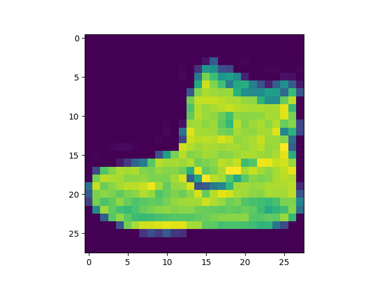

### 识别服装类型


#### 问题背景

https://www.youtube.com/watch?v=ifj5bAzrzMw

https://colab.research.google.com/github/lmoroney/mlday-tokyo/blob/master/Lab2-Computer-Vision.ipynb#scrollTo=q3KzJyjv3rnA


#### 操作

1. 使用Fashion MNIST数据集

   ```python
   mnist = tf.keras.datasets.fashion_mnist
   ```

2. 使用mnist的load_data方法可以获得两个列表，training和testing数据集，他们包含服装的图片和标记

   ```python
   (training_images, training_labels), (test_images, test_labels) = mnist.load_data()
   ```

3. 我们可以查看下数据集的内容

   ```python
   import matplotlib.pyplot as plt
   import pylab						
   
   plt.imshow(training_images[0])
   pylab.show()					# 一定要使用pylab.show()，否则图像不显示
   
   print(training_labels[0])
   print(training_images[0])
   ```

   

   图片，training_images[0]

   

   

   展示的数据

   ```python
   9
   [[  0   0   0   0   0   0   0   0   0   0   0   0   0   0   0   0   0   0
       0   0   0   0   0   0   0   0   0   0]
    [  0   0   0   0   0   0   0   0   0   0   0   0   0   0   0   0   0   0
       0   0   0   0   0   0   0   0   0   0]
    [  0   0   0   0   0   0   0   0   0   0   0   0   0   0   0   0   0   0
       0   0   0   0   0   0   0   0   0   0]
    [  0   0   0   0   0   0   0   0   0   0   0   0   1   0   0  13  73   0
       0   1   4   0   0   0   0   1   1   0]
    [  0   0   0   0   0   0   0   0   0   0   0   0   3   0  36 136 127  62
      54   0   0   0   1   3   4   0   0   3]
    [  0   0   0   0   0   0   0   0   0   0   0   0   6   0 102 204 176 134
     144 123  23   0   0   0   0  12  10   0]
    [  0   0   0   0   0   0   0   0   0   0   0   0   0   0 155 236 207 178
     107 156 161 109  64  23  77 130  72  15]
    [  0   0   0   0   0   0   0   0   0   0   0   1   0  69 207 223 218 216
     216 163 127 121 122 146 141  88 172  66]
    [  0   0   0   0   0   0   0   0   0   1   1   1   0 200 232 232 233 229
     223 223 215 213 164 127 123 196 229   0]
    [  0   0   0   0   0   0   0   0   0   0   0   0   0 183 225 216 223 228
     235 227 224 222 224 221 223 245 173   0]
    [  0   0   0   0   0   0   0   0   0   0   0   0   0 193 228 218 213 198
     180 212 210 211 213 223 220 243 202   0]
    [  0   0   0   0   0   0   0   0   0   1   3   0  12 219 220 212 218 192
     169 227 208 218 224 212 226 197 209  52]
    [  0   0   0   0   0   0   0   0   0   0   6   0  99 244 222 220 218 203
     198 221 215 213 222 220 245 119 167  56]
    [  0   0   0   0   0   0   0   0   0   4   0   0  55 236 228 230 228 240
     232 213 218 223 234 217 217 209  92   0]
    [  0   0   1   4   6   7   2   0   0   0   0   0 237 226 217 223 222 219
     222 221 216 223 229 215 218 255  77   0]
    [  0   3   0   0   0   0   0   0   0  62 145 204 228 207 213 221 218 208
     211 218 224 223 219 215 224 244 159   0]
    [  0   0   0   0  18  44  82 107 189 228 220 222 217 226 200 205 211 230
     224 234 176 188 250 248 233 238 215   0]
    [  0  57 187 208 224 221 224 208 204 214 208 209 200 159 245 193 206 223
     255 255 221 234 221 211 220 232 246   0]
    [  3 202 228 224 221 211 211 214 205 205 205 220 240  80 150 255 229 221
     188 154 191 210 204 209 222 228 225   0]
    [ 98 233 198 210 222 229 229 234 249 220 194 215 217 241  65  73 106 117
     168 219 221 215 217 223 223 224 229  29]
    [ 75 204 212 204 193 205 211 225 216 185 197 206 198 213 240 195 227 245
     239 223 218 212 209 222 220 221 230  67]
    [ 48 203 183 194 213 197 185 190 194 192 202 214 219 221 220 236 225 216
     199 206 186 181 177 172 181 205 206 115]
    [  0 122 219 193 179 171 183 196 204 210 213 207 211 210 200 196 194 191
     195 191 198 192 176 156 167 177 210  92]
    [  0   0  74 189 212 191 175 172 175 181 185 188 189 188 193 198 204 209
     210 210 211 188 188 194 192 216 170   0]
    [  2   0   0   0  66 200 222 237 239 242 246 243 244 221 220 193 191 179
     182 182 181 176 166 168  99  58   0   0]
    [  0   0   0   0   0   0   0  40  61  44  72  41  35   0   0   0   0   0
       0   0   0   0   0   0   0   0   0   0]
    [  0   0   0   0   0   0   0   0   0   0   0   0   0   0   0   0   0   0
       0   0   0   0   0   0   0   0   0   0]
    [  0   0   0   0   0   0   0   0   0   0   0   0   0   0   0   0   0   0
       0   0   0   0   0   0   0   0   0   0]]
   ```

   

4. 上面我们可以看到灰度图取值0-255，为了方便训练，我们把他们转换成0-1，这个过程叫做normalizing

   ```python
   training_images  = training_images / 255.0
   test_images = test_images / 255.0
   ```

   

5. 现在我们来设计模型

   ```python
   model = tf.keras.models.Sequential([
   	tf.keras.layers.Flatten(), 
   	tf.keras.layers.Dense(128, activation=tf.nn.relu), 
   	tf.keras.layers.Dense(10, activation=tf.nn.softmax)
   ])
   ```

   这里有一些关键概念

   `Sequential`: 定义了一个神经网络的层次。第一层Flatten()，第二层Dense()，第三层Dense()

   `Flatten`: 最初我们的图片是一个方形的矩阵，Flatten把他转成一个一维集合

   `Dense`：添加一个神经元层，每一个神经元曾需要一个activation function(激活函数)来告诉他们需要做什么。有很多可选项，这里我们使用了 tf.nn.relu 和 tf.nn.softmax

   `Relu`: 快速表达方式，如果 X>0 返回 X，否则返回 0

   `Softmax`: 接受一个数值集合，快速选择最大值。如果输入： [0.1, 0.1, 0.05, 0.1, 9.5, 0.1, 0.05, 0.05, 0.05]，他的返回就是  [0,0,0,0,1,0,0,0,0] 

6. 编译模型，指定loss function（损失函数）和optimizer（优化器），然后我们就可以使用fit方法来训练模型了

   ```python
   model.compile(
       optimizer = tf.keras.optimizers.Adam(),
   	loss = 'sparse_categorical_crossentropy',
   	metrics=['accuracy']
   )
   
   model.fit(training_images, training_labels, epochs=5)
   ```

   

7. 评估模型结果

   ```python
   model.evaluate(test_images, test_labels)
   ```


#### 整体代码和执行结果

代码

```python
import tensorflow as tf
import matplotlib.pyplot as plt
import pylab

print(tf.__version__)

mnist = tf.keras.datasets.fashion_mnist
(training_images, training_labels), (test_images, test_labels) = mnist.load_data()

plt.imshow(training_images[0])
pylab.show()
print(training_labels[0])
print(training_images[0])

training_images  = training_images / 255.0
test_images = test_images / 255.0

model = tf.keras.models.Sequential([tf.keras.layers.Flatten(),
                                    tf.keras.layers.Dense(128, activation=tf.nn.relu),
                                    tf.keras.layers.Dense(10, activation=tf.nn.softmax)
])

model.compile(
    optimizer = tf.keras.optimizers.Adam(),
	loss = 'sparse_categorical_crossentropy',
	metrics=['accuracy']
)

model.fit(training_images, training_labels, epochs=5)

print("评估结果")
print(model.evaluate(test_images, test_labels))
```

结果

```python
Epoch 1/5
1875/1875 [==============================] - 2s 1ms/step - loss: 0.5007 - accuracy: 0.8259
Epoch 2/5
1875/1875 [==============================] - 2s 1ms/step - loss: 0.3741 - accuracy: 0.8647
Epoch 3/5
1875/1875 [==============================] - 2s 984us/step - loss: 0.3363 - accuracy: 0.8768
Epoch 4/5
1875/1875 [==============================] - 2s 1ms/step - loss: 0.3131 - accuracy: 0.8846
Epoch 5/5
1875/1875 [==============================] - 2s 976us/step - loss: 0.2938 - accuracy: 0.8924

评估结果
313/313 [==============================] - 0s 751us/step - loss: 0.3589 - accuracy: 0.8715
[0.35891881585121155, 0.8715000152587891]
```


#### 练习问题

1. 跑测试集, 这个列表的意思是: It's the probability that this item is each of the 10 classes

   ```python
   classifications = model.predict(test_images)
   
   print(classifications[0])
   
   print(test_labels[0])### What does this list represent?
   ```

   

2. 增加神经元数量会怎样:   Training takes the same time, but is more accurate

   ```python
   model = tf.keras.models.Sequential([
   	tf.keras.layers.Flatten(),
   	tf.keras.layers.Dense(1024, activation=tf.nn.relu),		# 改成1024
   	tf.keras.layers.Dense(10, activation=tf.nn.softmax)
   ])
   ```

   

3. 关于Flatten()

   训练数据28*28像素，自动转换为784* * 1

   

4. 关于最后一层神经网络参数为什么是10

   因为我们训练目标标签有10个，所以此处必须是10。最后一层的神经元数量必须和标签数量相等，否则会报错

   ````python
   tf.keras.layers.Dense(10, activation=tf.nn.softmax)
   ````

   

5. 如何增加一个512神经元的层会有什么影响

   本例中我们处理的数据非常简单，因此下面的改动没什么影响。后续我们更加复杂的例子中会出现多层神经网络的用法

   ````python
   model = tf.keras.models.Sequential([tf.keras.layers.Flatten(),
   	tf.keras.layers.Dense(512, activation=tf.nn.relu),
   	tf.keras.layers.Dense(256, activation=tf.nn.relu),
   	tf.keras.layers.Dense(10, activation=tf.nn.softmax)
   ])
   ````

   

6. 提升epochs会有什么影响呢？
   本教程中原本代码，默认 epochs=5。我在上面使用了50。通常使用更大的 epochs，需要花费更多的训练时间，也能获得更好的model

   ```python
   model.fit(training_images, training_labels, epochs=50)
   ```

   

7. 我们如果不normalize数据到0-1区间，会有什么影响。注释掉下面两行

   我们来对比下性能吧

   ```python
   training_images  = training_images / 255.0
   test_images = test_images / 255.0
   
   model = tf.keras.models.Sequential([
       tf.keras.layers.Flatten(),
       tf.keras.layers.Dense(64, activation=tf.nn.relu),
       tf.keras.layers.Dense(10, activation=tf.nn.softmax)
   ])
   ```

   

   ```
   评估结果
   313/313 [==============================] - 0s 585us/step - loss: 0.4462 - accuracy: 0.8858
   [0.4461592733860016, 0.8858000040054321]
   ```

   

   然后我们去掉normalize代码，在运行

   ```python
   # training_images=training_images/255.0
   # test_images=test_images/255.0
   ```

   执行结果

   ```
   评估结果
   313/313 [==============================] - 0s 701us/step - loss: 0.5727 - accuracy: 0.8271
   [0.5727213025093079, 0.8270999789237976]
   ```

   0.8858 vs 0.8271

   看起来有normalize，训练结果会更好一些

   

8. 加入我们预期是95%准确率，那么如果在10次epochs我们就达到了这个准确率，为什么我们还要等50次全部执行完呢？我们完全可以提前终止训练过程。我们通过指定callback来实现这一功能

   ```python
   # 定义并创建一个callback
   class myCallback(tf.keras.callbacks.Callback):
     def on_epoch_end(self, epoch, logs={}):
       if(logs.get('accuracy')>0.9):
         print("\nReached 90% accuracy so cancelling training!")
         self.model.stop_training = True
   callbacks = myCallback()
   
   。。。。。。
   
   # 使用 callbacks=[callbacks]
   model.fit(training_images, training_labels, epochs=5, callbacks=[callbacks])
   ```

    

