### 卷积神经网络


https://www.youtube.com/watch?v=UzJc283xy34


坑逼教程，资源链接打不开了。下面这两个教程拼起来差不多就是这个视频的内容了


Lab

- [x] http://clmirror.storage.googleapis.com/codelabs/tensorflow-lab3-convolutions/index.html?index=..%2F..index#8

- [x] https://developers.google.com/codelabs/tensorflow-4-cnns#2
- [x] https://developers.google.com/codelabs/tensorflow-5-compleximages#0


数据集

https://laurencemoroney.com/datasets.html


#### 背景

上一篇我们介绍了如何使用深度神经网络模型，把图像匹配成标签。这个方法很有局限性，图片中的物件必须在图像正中间，途中其他物品不能对它进行干扰

如果我们想识别这样的图片，上一篇的算法可能无法识别，他没有经过这样的训练。这里我们就需要卷积神经网络。

我们先用卷积神经网络对图像进行过滤，然后再进行深度学习

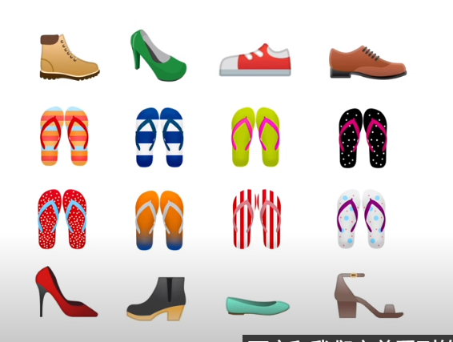


#### 理论


#### 卷积计算过程

卷积核放在像素矩阵上，求和累加取平均。我还没学会怎么再typora打公式。。先截图把

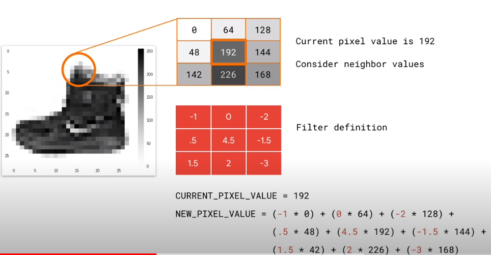


卷积过程最关键的问题就是如何选择卷积核


我们先用matplot展示一张图，并用numpy存储它

```python
import cv2
import numpy as np
from scipy import misc
import matplotlib.pyplot as plt

i = misc.ascent()

plt.grid(False)
plt.gray()
plt.axis('off')
plt.imshow(i)
plt.show()

# 用numpy存储图片
i_transformed = np.copy(i)
size_x = i_transformed.shape[0]
size_y = i_transformed.shape[1]

# 输出图像宽和高 : 512 *512
print(size_x)
print(size_y)

# 现在我们来实现卷积,计算过程简单但计算量大，不多说
filter = [ [-1, -2, -1], [0, 0, 0], [1, 2, 1]]
weight  = 1
for x in range(1, size_x-1):
  for y in range(1, size_y-1):
      output_pixel = 0.0
      output_pixel = output_pixel + (i[x - 1, y-1] * filter[0][0])
      output_pixel = output_pixel + (i[x, y-1] * filter[0][1])
      output_pixel = output_pixel + (i[x + 1, y-1] * filter[0][2])
      output_pixel = output_pixel + (i[x-1, y] * filter[1][0])
      output_pixel = output_pixel + (i[x, y] * filter[1][1])
      output_pixel = output_pixel + (i[x+1, y] * filter[1][2])
      output_pixel = output_pixel + (i[x-1, y+1] * filter[2][0])
      output_pixel = output_pixel + (i[x, y+1] * filter[2][1])
      output_pixel = output_pixel + (i[x+1, y+1] * filter[2][2])
      output_pixel = output_pixel * weight
      if(output_pixel<0):
        output_pixel=0
      if(output_pixel>255):
        output_pixel=255
      i_transformed[x, y] = output_pixel

# 输出卷积之后的图片
plt.gray()
plt.grid(False)
plt.imshow(i_transformed)
#plt.axis('off')
plt.show()   
```


效果图

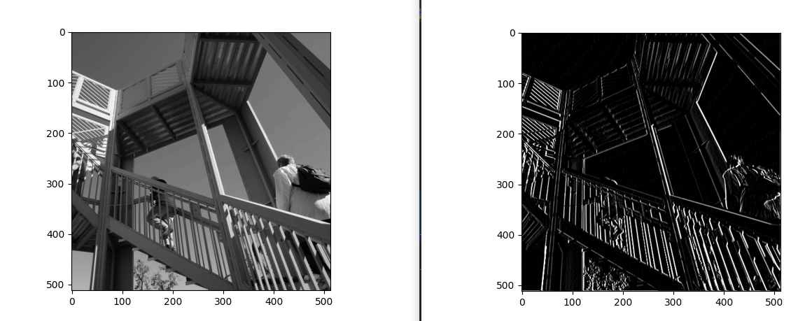


重点就是filter参数了，上面我们使用的是。下面我们换一些其他看看


使用filter = [[-1, 0, 1], [-2, 0, 2], [-1, 0, 1]]，则明显竖线更加清晰了

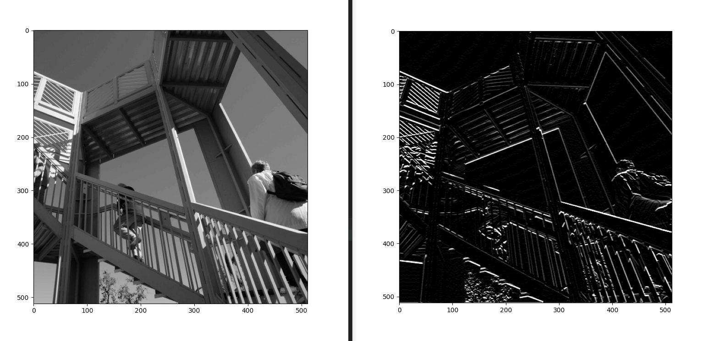


使用filter = [[-1, 2, 1], [0, 0, 0], [-1,0,1]]，则明显竖线更加清晰了

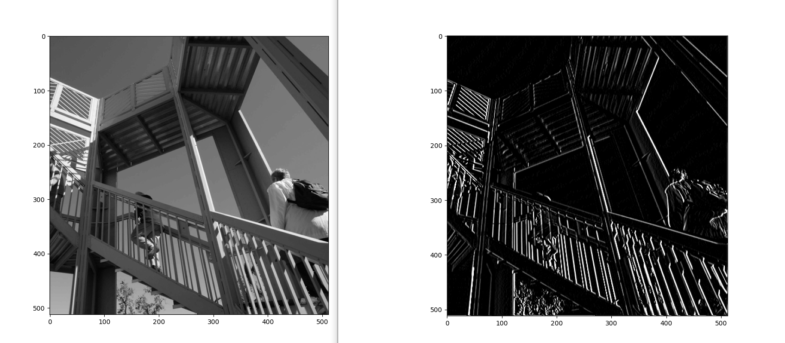


#### `Pooling` 池化过程池化

参考：https://zhuanlan.zhihu.com/p/78760534

最大化池化，就是把4*4过滤到2*2中，每个2*2的小格子都取最大值，原图被缩小到1/4尺寸，但是会保留原图的特征。

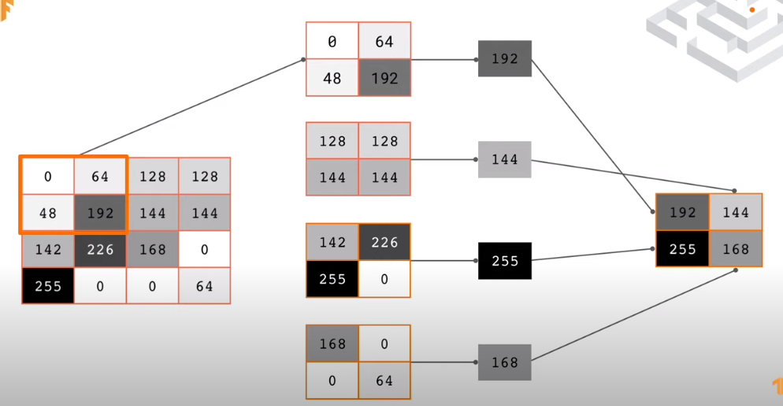


下面是效果对比

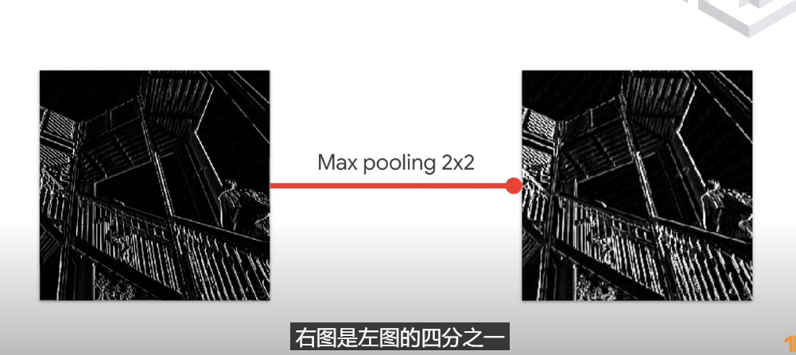


来吧代码实现以下

```python
new_x = int(size_x/2)
new_y = int(size_y/2)
newImage = np.zeros((new_x, new_y))
for x in range(0, size_x, 2):
  for y in range(0, size_y, 2):
    pixels = []
    pixels.append(i_transformed[x, y])
    pixels.append(i_transformed[x+1, y])
    pixels.append(i_transformed[x, y+1])
    pixels.append(i_transformed[x+1, y+1])
    pixels.sort(reverse=True)
    newImage[int(x/2),int(y/2)] = pixels[0]
 
# Plot the image. Note the size of the axes -- now 256 pixels instead of 512
plt.gray()
plt.grid(False)
plt.imshow(newImage)
#plt.axis('off')
plt.show()
```


效果：500*500图变成了250 * 250，整体特征不变

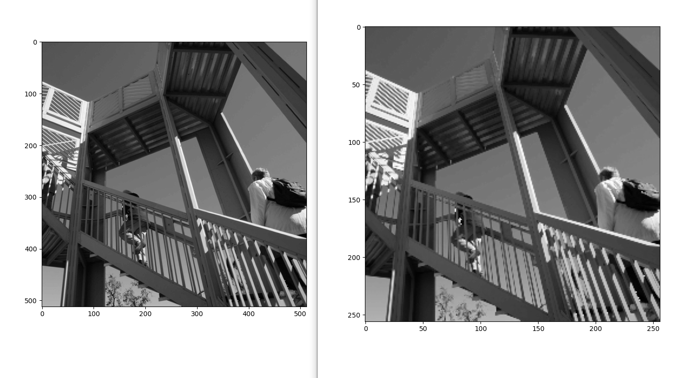


#### 开始实验

背景介绍结束了，开始试验。原视频里的文档连接失效，404找不到，导致我心脏病差一点发作。。好在各种google找到了对应的资料，虽然是2合1。


视频中实操层面唯一有效的代码信息就是这一段了

```python
model = tf.keras.models.Sequential([
    tf.keras.layers.Conv2D(64, (3, 3), activation="relu", input_shape=(28, 28, 1)),
    tf.keras.layers.MaxPooling2D(2, 2),
    tf.keras.layers.Conv2D(64, (3, 3), activation="relu", input_shape=(28, 28, 1)),
    tf.keras.layers.MaxPooling2D(2, 2),
    tf.keras.layers.Flatten(),
    tf.keras.layers.Dense(128, activation=tf.nn.relu),
    tf.keras.layers.Dense(10, activation=tf.nn.softmax)
])
```


我们来优化 2.cloth 的准确率

2.cloth中，我们通过50 epochs可以使得训练准确度达到95%，但是测试准确率只有85%。

代码

```python
training_images  = training_images / 255.0
test_images = test_images / 255.0

model = tf.keras.models.Sequential([tf.keras.layers.Flatten(),
                                    tf.keras.layers.Dense(512, activation=tf.nn.relu),
                                    tf.keras.layers.Dense(10, activation=tf.nn.softmax)
])

model.compile(
    optimizer=tf.keras.optimizers.Adam(),
    loss='sparse_categorical_crossentropy',
    metrics=['accuracy']
)

model.fit(training_images, training_labels, epochs=50, callbacks=[callbacks])

```


使用卷积神经网络优化

```python
import tensorflow as tf
import matplotlib.pyplot as plt
import pylab

mnist = tf.keras.datasets.fashion_mnist
(training_images, training_labels), (test_images, test_labels) = mnist.load_data()

training_images = training_images.reshape(60000, 28, 28, 1)
test_images = test_images.reshape(10000, 28, 28, 1)

# normalizing
training_images = training_images / 255.0
test_images = test_images / 255.0

# model
model = tf.keras.models.Sequential([
  tf.keras.layers.Conv2D(64, (3, 3), activation='relu', input_shape=(28, 28, 1)),
  tf.keras.layers.MaxPooling2D(2, 2),
  tf.keras.layers.Conv2D(64, (3, 3), activation='relu'),
  tf.keras.layers.MaxPooling2D(2,2),
  tf.keras.layers.Flatten(),
  tf.keras.layers.Dense(128, activation='relu'),
  tf.keras.layers.Dense(10, activation='softmax')
])

model.compile(optimizer='adam', loss='sparse_categorical_crossentropy', metrics=['accuracy'])

# 打印模型信息
model.summary()

model.fit(training_images, training_labels, epochs=10)
test_loss, test_accuracy = model.evaluate(test_images, test_labels)
print("\n\n评估结果")
print ('Test loss: {}, Test accuracy: {}'.format(test_loss, test_accuracy*100))
```


效果。 epochs=10， 训练准确率91.1%，测试准确率91.1%。模型能力强了不少

```python
Epoch 5/10
1875/1875 [==============================] - 37s 19ms/step - loss: 0.1877 - accuracy: 0.9294
Epoch 6/10
1875/1875 [==============================] - 37s 20ms/step - loss: 0.1627 - accuracy: 0.9397
Epoch 7/10
1875/1875 [==============================] - 37s 20ms/step - loss: 0.1432 - accuracy: 0.9453
Epoch 8/10
1875/1875 [==============================] - 41s 22ms/step - loss: 0.1238 - accuracy: 0.9530
Epoch 9/10
1875/1875 [==============================] - 46s 25ms/step - loss: 0.1094 - accuracy: 0.9583
Epoch 10/10
1875/1875 [==============================] - 45s 24ms/step - loss: 0.0974 - accuracy: 0.9629
313/313 [==============================] - 3s 9ms/step - loss: 0.3081 - accuracy: 0.9110


评估结果
Test loss: 0.3081018030643463, Test accuracy: 91.10000133514404
```


#### 代码分析

1. 收集数据的方法变了。因为卷积需要包含所有内容的张亮，我们不能再直接使用flat()传入一维数据集合。我们需要用reshape方法把训练改成60000(张) * 28 * 28 * 1，否则训练时候会报错，卷积无法识别形状

   ```python
   training_images=training_images.reshape(60000, 28, 28, 1)
   training_images = training_images/255.0
   test_images = test_images.reshape(10000, 28, 28, 1)
   test_images = test_images/255.0
   
   
   # 卷积模型参数
   tf.keras.layers.Conv2D(64, (3, 3), activation='relu', input_shape=(28, 28, 1))
   ```

   

2. 定义模型

   使用model.summary()输出神经网络的大小和形状

   ```python
   Model: "sequential"
   _________________________________________________________________
   Layer (type)                 Output Shape              Param #   
   =================================================================
   conv2d (Conv2D)              (None, 26, 26, 64)        640       
   _________________________________________________________________
   max_pooling2d (MaxPooling2D) (None, 13, 13, 64)        0         
   _________________________________________________________________
   conv2d_1 (Conv2D)            (None, 11, 11, 64)        36928     
   _________________________________________________________________
   max_pooling2d_1 (MaxPooling2 (None, 5, 5, 64)          0         
   _________________________________________________________________
   flatten (Flatten)            (None, 1600)              0         
   _________________________________________________________________
   dense (Dense)                (None, 128)               204928    
   _________________________________________________________________
   dense_1 (Dense)              (None, 10)                1290      
   =================================================================
   Total params: 243,786
   Trainable params: 243,786
   Non-trainable params: 0
   ```

   模型定义

   ```python
   model = tf.keras.models.Sequential([
       # 第一层卷积
   	tf.keras.layers.Conv2D(32, (3, 3), activation='relu', input_shape=(28, 28, 1)),
       # 第一层最大池化
   	tf.keras.layers.MaxPooling2D(2, 2),
       # 第二层卷积
       tf.keras.layers.Conv2D(64, (3,3), activation='relu'),
       # 第二层最大池化
       tf.keras.layers.MaxPooling2D(2, 2),
      
       tf.keras.layers.Flatten(),
       tf.keras.layers.Dense(128, activation='relu'),
       tf.keras.layers.Dense(10, activation='softmax')
   ])
   ```

   


#### 识别马和人

1. 下载数据

   ```shell
   !wget --no-check-certificate https://storage.googleapis.com/laurencemoroney-blog.appspot.com/horse-or-human.zip  -O /tmp/horse-or-human.zip
   ```

   

2. 使用zip库操作数据文件

   ```python
   import os
   import zipfile
   
   local_zip = 'data/horse-or-human.zip'
   zip_ref = zipfile.ZipFile(local_zip, 'r')
   r = zip_ref.extractall('horse-or-human')
   zip_ref.close()
   ```

   我们可以看到horse-or-human目录中有两个子目录，horses和humans，各自包含一批图片

   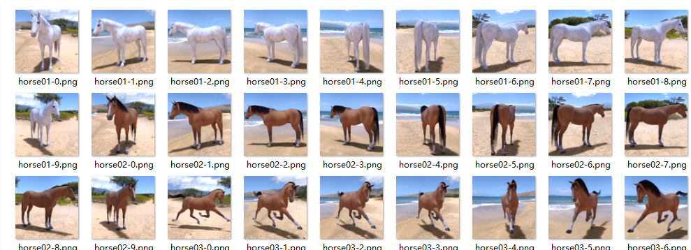

   

   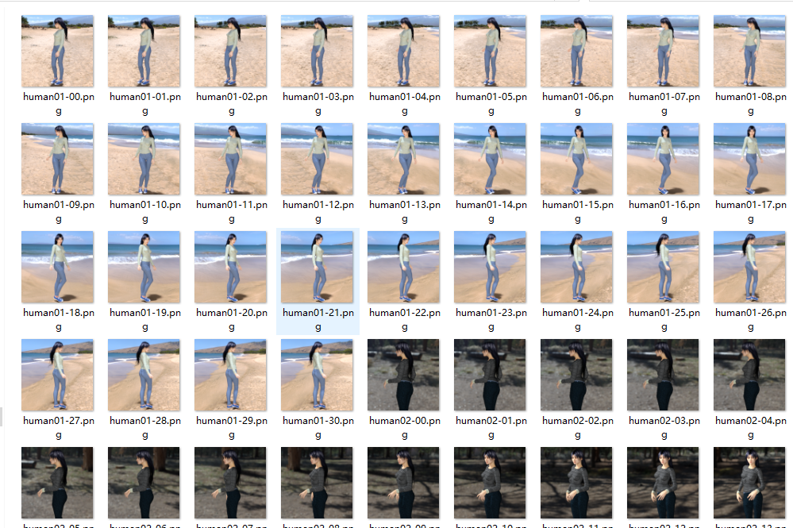

   

3. 使用Image Generator标记和准备数据。Image Generator会读取子目录中的图像，冰根据子目录的名称自动标记这些图像。我们这里训练数据报里有一个horses目录和一个humans目录，Image Generator回味图像添加合适的标签，从而减少编码量

   

   定义目录

   ```python
   # Directory with our training horse and human pictures
   train_horse_dir = os.path.join('horse-or-human/horses')
   train_human_dir = os.path.join('horse-or-human/humans')
   ```

   

   查看horses和humans训练目录中的文件名是什么样子

   ```python
   train_horse_names = os.listdir(train_horse_dir)
   print(train_horse_names[:10])
   train_human_names = os.listdir(train_human_dir)
   print(train_human_names[:10])
   ```

   

   查看horse和human的图像总数

   ```python
   print('total training horse images:', len(os.listdir(train_horse_dir)))
   print('total training human images:', len(os.listdir(train_human_dir)))
   ```

   

   输出

   ```python
   ['horse01-0.png', 'horse01-1.png', 'horse01-2.png', 'horse01-3.png', 'horse01-4.png', 'horse01-5.png', 'horse01-6.png', 'horse01-7.png', 'horse01-8.png', 'horse01-9.png']
   ['human01-00.png', 'human01-01.png', 'human01-02.png', 'human01-03.png', 'human01-04.png', 'human01-05.png', 'human01-06.png', 'human01-07.png', 'human01-08.png', 'human01-09.png']
   total training horse images: 500
   total training human images: 527
   ```

   

4. 探索数据

   ```python
   import matplotlib.pyplot as plt
   import matplotlib.image as mpimg
   
   # Parameters for our graph; we'll output images in a 4x4 configuration
   nrows = 4
   ncols = 4
   
   # Index for iterating over images
   pic_index = 0
   
   fig = plt.gcf()
   fig.set_size_inches(ncols * 4, nrows * 4)
   
   pic_index += 8
   next_horse_pix = [os.path.join(train_horse_dir, fname)
                   for fname in train_horse_names[pic_index-8:pic_index]]
   next_human_pix = [os.path.join(train_human_dir, fname)
                   for fname in train_human_names[pic_index-8:pic_index]]
   
   for i, img_path in enumerate(next_horse_pix+next_human_pix):
     # Set up subplot; subplot indices start at 1
     sp = plt.subplot(nrows, ncols, i + 1)
     sp.axis('Off') # Don't show axes (or gridlines)
   
     img = mpimg.imread(img_path)
     plt.imshow(img)
   
   plt.show()
   
   ```

   

   程序输出

   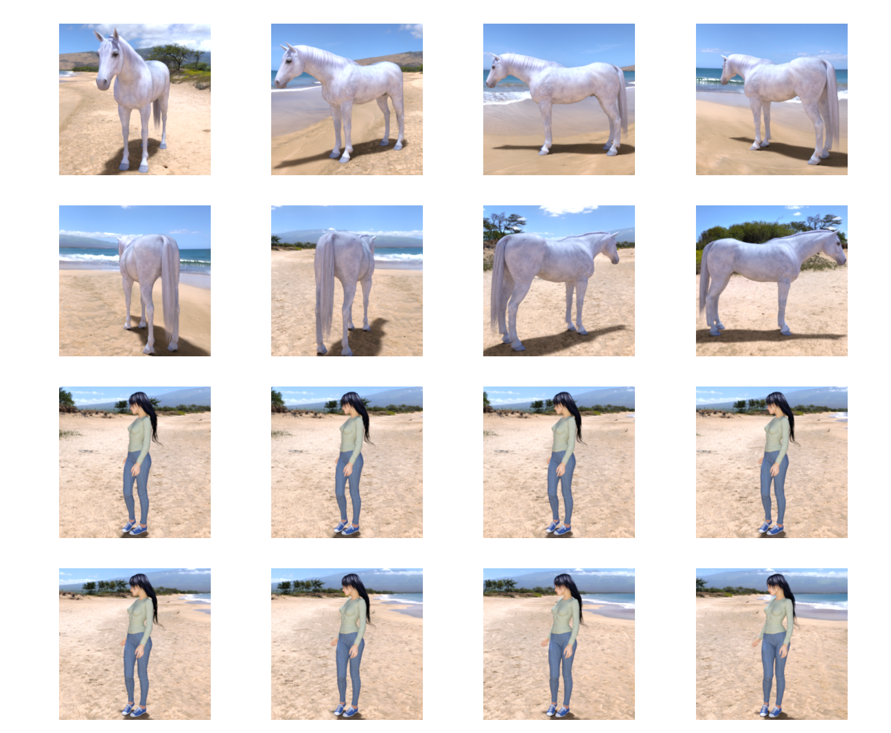

5. 定义和编译模型

   ```python
   import tensorflow as tf
   
   model = tf.keras.models.Sequential([
       # Note the input shape is the desired size of the image 300x300 with 3 bytes color
       # This is the first convolution
       tf.keras.layers.Conv2D(16, (3,3), activation='relu', input_shape=(300, 300, 3)),
       tf.keras.layers.MaxPooling2D(2, 2),
       # The second convolution
       tf.keras.layers.Conv2D(32, (3,3), activation='relu'),
       tf.keras.layers.MaxPooling2D(2,2),
       # The third convolution
       tf.keras.layers.Conv2D(64, (3,3), activation='relu'),
       tf.keras.layers.MaxPooling2D(2,2),
       # The fourth convolution
       tf.keras.layers.Conv2D(64, (3,3), activation='relu'),
       tf.keras.layers.MaxPooling2D(2,2),
       # The fifth convolution
       tf.keras.layers.Conv2D(64, (3,3), activation='relu'),
       tf.keras.layers.MaxPooling2D(2,2),
       # Flatten the results to feed into a DNN
       tf.keras.layers.Flatten(),
       # 512 neuron hidden layer
       tf.keras.layers.Dense(512, activation='relu'),
       # Only 1 output neuron. It will contain a value from 0-1 where 0 for 1 class ('horses') and 1 for the other ('humans')
       tf.keras.layers.Dense(1, activation='sigmoid')
   ])
   
   model.summary()
   ```

   输出

   ```
   Model: "sequential"
   _________________________________________________________________
   Layer (type)                 Output Shape              Param #   
   =================================================================
   conv2d (Conv2D)              (None, 298, 298, 16)      448       
   _________________________________________________________________
   max_pooling2d (MaxPooling2D) (None, 149, 149, 16)      0         
   _________________________________________________________________
   conv2d_1 (Conv2D)            (None, 147, 147, 32)      4640      
   _________________________________________________________________
   max_pooling2d_1 (MaxPooling2 (None, 73, 73, 32)        0         
   _________________________________________________________________
   conv2d_2 (Conv2D)            (None, 71, 71, 64)        18496     
   _________________________________________________________________
   max_pooling2d_2 (MaxPooling2 (None, 35, 35, 64)        0         
   _________________________________________________________________
   conv2d_3 (Conv2D)            (None, 33, 33, 64)        36928     
   _________________________________________________________________
   max_pooling2d_3 (MaxPooling2 (None, 16, 16, 64)        0         
   _________________________________________________________________
   conv2d_4 (Conv2D)            (None, 14, 14, 64)        36928     
   _________________________________________________________________
   max_pooling2d_4 (MaxPooling2 (None, 7, 7, 64)          0         
   _________________________________________________________________
   flatten (Flatten)            (None, 3136)              0         
   _________________________________________________________________
   dense (Dense)                (None, 512)               1606144   
   _________________________________________________________________
   dense_1 (Dense)              (None, 1)                 513       
   =================================================================
   Total params: 1,704,097
   Trainable params: 1,704,097
   Non-trainable params: 0
   _________________________________________________________________
   ```

   

6. 编译模型。这里我们使用`binary_crossentropy`损失函数训练模型，因为他是二元分类问题，而最终激活函数是sigmoid。使用rmsprop作为优化器，学习速率为 0.001

   ```python
   from tensorflow.keras.optimizers import RMSprop
   
   model.compile(loss='binary_crossentropy',
                 optimizer=RMSprop(learning_rate=0.001), # lr已经废弃了，使用learning_rate
                 metrics=['acc'])
   ```

7. 生成训练模型

   ```python
   from tensorflow.keras.preprocessing.image import ImageDataGenerator
   
   # All images will be rescaled by 1./255
   train_datagen = ImageDataGenerator(rescale=1./255)
   
   # Flow training images in batches of 128 using train_datagen generator
   train_generator = train_datagen.flow_from_directory(
           '/tmp/horse-or-human/',  # This is the source directory for training images
           target_size=(300, 300),  # All images will be resized to 150x150
           batch_size=128,
           # Since we use binary_crossentropy loss, we need binary labels
           class_mode='binary')
   ```

8. 开始训练

   ```python
   history = model.fit(
         train_generator,
         steps_per_epoch=8,
         epochs=15,
         verbose=1)
   ```

   

9. 评估结果，创建文件夹

   

   ```python
   pip install pandas
   pip install jupyter
   pip install google-colab   # 需要翻墙
   
   def predict(model):
       uploaded = files.upload()
   
       for fn in uploaded.keys():
   
           # predicting images
           path = '/test_data/' + fn
           img = image.load_img(path, target_size=(300, 300))
           x = image.img_to_array(img)
           x = np.expand_dims(x, axis=0)
   
           images = np.vstack([x])
           classes = model.predict(images, batch_size=10)
           print(classes[0])
           if classes[0] > 0.5:
               print(fn + " is a human")
           else:
               print(fn + " is a horse")
   
   predict(model)
   ```


#### 工程化代码和执行效果

官方测试图片集

https://laurencemoroney.com/datasets.html


代码

```python
import os
import zipfile
import matplotlib.pyplot as plt
import matplotlib.image as mpimg
import tensorflow as tf
from tensorflow.keras.optimizers import RMSprop
from tensorflow.keras.preprocessing.image import ImageDataGenerator
import numpy as np
from keras.preprocessing import image


def load_data():
    local_zip = 'data/horse-or-human.zip'
    zip_ref = zipfile.ZipFile(local_zip, 'r')
    r = zip_ref.extractall('horse-or-human')
    zip_ref.close()

    # Directory with our training horse and human pictures
    train_horse_dir = os.path.join('horse-or-human/horses')
    train_human_dir = os.path.join('horse-or-human/humans')

    train_horse_names = os.listdir(train_horse_dir)
    print(train_horse_names[:10])
    train_human_names = os.listdir(train_human_dir)
    print(train_human_names[:10])

    print('total training horse images:', len(os.listdir(train_horse_dir)))
    print('total training human images:', len(os.listdir(train_human_dir)))
    return train_horse_dir, train_human_dir, train_horse_names, train_human_names


def show_images(train_horse_dir, train_human_dir, train_horse_names, train_human_names):
    # Parameters for our graph; we'll output images in a 4x4 configuration
    nrows = 4
    ncols = 4

    # Index for iterating over images
    pic_index = 0

    fig = plt.gcf()
    fig.set_size_inches(ncols * 4, nrows * 4)

    pic_index += 8
    next_horse_pix = [os.path.join(train_horse_dir, fname)
                      for fname in train_horse_names[pic_index - 8:pic_index]]
    next_human_pix = [os.path.join(train_human_dir, fname)
                      for fname in train_human_names[pic_index - 8:pic_index]]

    for i, img_path in enumerate(next_horse_pix + next_human_pix):
        # Set up subplot; subplot indices start at 1
        sp = plt.subplot(nrows, ncols, i + 1)
        sp.axis('Off')  # Don't show axes (or gridlines)

        img = mpimg.imread(img_path)
        plt.imshow(img)

    plt.show()


def get_model():
    model = tf.keras.models.Sequential([
        # Note the input shape is the desired size of the image 300x300 with 3 bytes color
        # This is the first convolution
        tf.keras.layers.Conv2D(16, (3, 3), activation='relu', input_shape=(300, 300, 3)),
        tf.keras.layers.MaxPooling2D(2, 2),
        # The second convolution
        tf.keras.layers.Conv2D(32, (3, 3), activation='relu'),
        tf.keras.layers.MaxPooling2D(2, 2),
        # The third convolution
        tf.keras.layers.Conv2D(64, (3, 3), activation='relu'),
        tf.keras.layers.MaxPooling2D(2, 2),
        # The fourth convolution
        tf.keras.layers.Conv2D(64, (3, 3), activation='relu'),
        tf.keras.layers.MaxPooling2D(2, 2),
        # The fifth convolution
        tf.keras.layers.Conv2D(64, (3, 3), activation='relu'),
        tf.keras.layers.MaxPooling2D(2, 2),
        # Flatten the results to feed into a DNN
        tf.keras.layers.Flatten(),
        # 512 neuron hidden layer
        tf.keras.layers.Dense(512, activation='relu'),
        # Only 1 output neuron. It will contain a value from 0-1 where 0 for 1 class ('horses') and 1 for the other ('humans')
        tf.keras.layers.Dense(1, activation='sigmoid')
    ])

    model.summary()
    return model


def predict(model, folder, type):
    test_dir = os.path.join(folder)
    test_names = os.listdir(test_dir)
    print(test_names[:10])

    correct = 0
    total = 0
    for fn in test_names:
        path = folder + fn
        #path = "horse-or-human/humans/" + fn
        img = image.load_img(path, target_size=(300, 300))
        x = image.img_to_array(img)
        x = np.expand_dims(x, axis=0)

        images = np.vstack([x])
        classes = model.predict(images, batch_size=10)

        if classes[0] > 0.5:
            print(fn + " is a human", classes[0])
            if type == 'human':
                correct += 1
        else:
            print(fn + " is a horse", classes[0])
            if type == 'horse':
                correct += 1

        total += 1
    return correct, total


def main():
    train_horse_dir, train_human_dir, train_horse_names, train_human_names = load_data()
    show_images(train_horse_dir, train_human_dir, train_horse_names, train_human_names)
    model = get_model()
    model.compile(loss='binary_crossentropy',
              optimizer=RMSprop(learning_rate=0.001),
              metrics=['acc'])

    train_datagen = ImageDataGenerator(rescale=1. / 255)
    train_generator = train_datagen.flow_from_directory(
        'horse-or-human/',  # This is the source directory for training images
        target_size=(300, 300),  # All images will be resized to 150x150
        batch_size=128,
        # Since we use binary_crossentropy loss, we need binary labels
        class_mode='binary')

    history = model.fit(
        train_generator,
        steps_per_epoch=8,
        epochs=20,
        verbose=1)

    correct1, total1 = predict(model, 'test_data/humans/', 'human')

    correct2, total2 = predict(model, 'test_data/horses/', 'horse')
    print("human rate: correct = ", correct1, ", total = ", total1, ", rate = ", correct1 / total1)
    print("horse rate: correct = ", correct2, ", total = ", total2, ", rate = ", correct2/total2)


main()
```


测试图

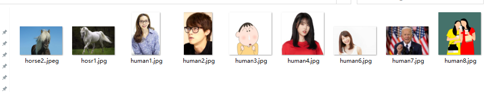


测试结果，人类识别效率98.4%，马的识别率79.6%。马识别率有点低

```python
horse6-275.png is a horse [0.]
horse6-345.png is a horse [0.]
horse6-403.png is a horse [0.]
horse6-544.png is a horse [0.]

human rate: correct =  126 , total =  128 , rate =  0.984375
horse rate: correct =  102 , total =  128 , rate =  0.796875
```


#### 换个视角看看每次变换后的效果

```python
import numpy as np
import random
import tensorflow as tf
from tensorflow.keras.preprocessing.image import img_to_array, load_img
import matplotlib.pyplot as plt
import zipfile
import os


def load_data():
    local_zip = 'data/horse-or-human.zip'
    zip_ref = zipfile.ZipFile(local_zip, 'r')
    r = zip_ref.extractall('horse-or-human')
    zip_ref.close()

    # Directory with our training horse and human pictures
    train_horse_dir = os.path.join('horse-or-human/horses')
    train_human_dir = os.path.join('horse-or-human/humans')

    train_horse_names = os.listdir(train_horse_dir)
    print(train_horse_names[:10])
    train_human_names = os.listdir(train_human_dir)
    print(train_human_names[:10])

    print('total training horse images:', len(os.listdir(train_horse_dir)))
    print('total training human images:', len(os.listdir(train_human_dir)))
    return train_horse_dir, train_human_dir, train_horse_names, train_human_names


def get_model():
    model = tf.keras.models.Sequential([
        # Note the input shape is the desired size of the image 300x300 with 3 bytes color
        # This is the first convolution
        tf.keras.layers.Conv2D(16, (3, 3), activation='relu', input_shape=(300, 300, 3)),
        tf.keras.layers.MaxPooling2D(2, 2),
        # The second convolution
        tf.keras.layers.Conv2D(32, (3, 3), activation='relu'),
        tf.keras.layers.MaxPooling2D(2, 2),
        # The third convolution
        tf.keras.layers.Conv2D(64, (3, 3), activation='relu'),
        tf.keras.layers.MaxPooling2D(2, 2),
        # The fourth convolution
        tf.keras.layers.Conv2D(64, (3, 3), activation='relu'),
        tf.keras.layers.MaxPooling2D(2, 2),
        # The fifth convolution
        tf.keras.layers.Conv2D(64, (3, 3), activation='relu'),
        tf.keras.layers.MaxPooling2D(2, 2),
        # Flatten the results to feed into a DNN
        tf.keras.layers.Flatten(),
        # 512 neuron hidden layer
        tf.keras.layers.Dense(512, activation='relu'),
        # Only 1 output neuron. It will contain a value from 0-1 where 0 for 1 class ('horses') and 1 for the other ('humans')
        tf.keras.layers.Dense(1, activation='sigmoid')
    ])

    model.summary()
    return model


train_horse_dir, train_human_dir, train_horse_names, train_human_names = load_data()
model = get_model()
# Let's define a new Model that will take an image as input, and will output
# intermediate representations for all layers in the previous model after
# the first.
successive_outputs = [layer.output for layer in model.layers[1:]]
# visualization_model = Model(img_input, successive_outputs)
visualization_model = tf.keras.models.Model(inputs=model.input, outputs=successive_outputs)
# Let's prepare a random input image from the training set.
horse_img_files = [os.path.join(train_horse_dir, f) for f in train_horse_names]
human_img_files = [os.path.join(train_human_dir, f) for f in train_human_names]
img_path = random.choice(horse_img_files + human_img_files)

img = load_img(img_path, target_size=(300, 300))  # this is a PIL image
x = img_to_array(img)  # Numpy array with shape (150, 150, 3)
x = x.reshape((1,) + x.shape)  # Numpy array with shape (1, 150, 150, 3)

# Rescale by 1/255
x /= 255

# Let's run our image through our network, thus obtaining all
# intermediate representations for this image.
successive_feature_maps = visualization_model.predict(x)

# These are the names of the layers, so can have them as part of our plot
layer_names = [layer.name for layer in model.layers]

# Now let's display our representations
for layer_name, feature_map in zip(layer_names, successive_feature_maps):
    if len(feature_map.shape) == 4:
        # Just do this for the conv / maxpool layers, not the fully-connected layers
        n_features = feature_map.shape[-1]  # number of features in feature map
        # The feature map has shape (1, size, size, n_features)
        size = feature_map.shape[1]
        # We will tile our images in this matrix
        display_grid = np.zeros((size, size * n_features))
        for i in range(n_features):
            # Postprocess the feature to make it visually palatable
            x = feature_map[0, :, :, i]
            x -= x.mean()
            if x.std() > 0:
                x /= x.std()
            x *= 64
            x += 128
            x = np.clip(x, 0, 255).astype('uint8')
            # We'll tile each filter into this big horizontal grid
            display_grid[:, i * size: (i + 1) * size] = x
        # Display the grid
        scale = 20. / n_features
        plt.figure(figsize=(scale * n_features, scale))
        plt.title(layer_name)
        plt.grid(False)
        plt.imshow(display_grid, aspect='auto', cmap='viridis')

plt.show()

```


第一张图


最后一张图


可以看出，多次卷积之后，图片变得非常抽象，只剩下一些细节特征
