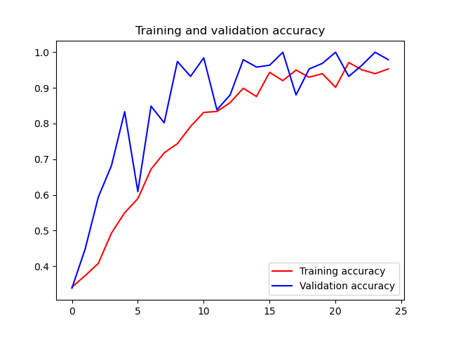

### 识别剪刀石头布


https://www.youtube.com/watch?v=KXo8ZOa-dYg

数据集：https://www.tensorflow.org/datasets/catalog/rock_paper_scissors

lab：https://colab.sandbox.google.com/github/lmoroney/dlaicourse/blob/master/Course%202%20-%20Part%208%20-%20Lesson%202%20-%20Notebook%20(RockPaperScissors).ipynb


#### 区分石头剪刀布


#### 实验

1. 下载数据集

   ```shell
   # 训练数据
   !wget --no-check-certificate \
       https://storage.googleapis.com/laurencemoroney-blog.appspot.com/rps.zip \
       -O /tmp/rps.zip
   
   # 测试数据
   !wget --no-check-certificate \
       https://storage.googleapis.com/laurencemoroney-blog.appspot.com/rps-test-set.zip \
       -O /tmp/rps-test-set.zip
   ```

   

2. 设计下代码结构

   ```python
   import os
   import matplotlib.pyplot as plt
   import matplotlib.image as mpimg
   import tensorflow as tf
   import keras_preprocessing
   from keras_preprocessing import image
   from keras_preprocessing.image import ImageDataGenerator
   import matplotlib.pyplot as plt
   import numpy as np
   
   TRAINING_DIR = 'rock-paper-scissors/rps'
   VALIDATION_DIR = 'rock-paper-scissors/rps-test-set'
   
   MODEL_FILE = 'rps_model.h5'
   
   rock_dir = os.path.join(TRAINING_DIR + '/rock')
   paper_dir = os.path.join(TRAINING_DIR + '/paper')
   scissors_dir = os.path.join(TRAINING_DIR + '/scissors')
   
   
   def get_files():
       rock_files = os.listdir(rock_dir)
       paper_files = os.listdir(paper_dir)
       scissors_files = os.listdir(scissors_dir)
       return rock_files, paper_files, scissors_files
   
   
   def show(rock_files, paper_files, scissors_files):
       pic_index = 2
       next_rock = [os.path.join(rock_dir, fname)
                    for fname in rock_files[pic_index - 2:pic_index]]
       next_paper = [os.path.join(paper_dir, fname)
                     for fname in paper_files[pic_index - 2:pic_index]]
       next_scissors = [os.path.join(scissors_dir, fname)
                        for fname in scissors_files[pic_index - 2:pic_index]]
   
       for i, img_path in enumerate(next_rock + next_paper + next_scissors):
           # print(img_path)
           img = mpimg.imread(img_path)
           plt.imshow(img)
           plt.axis('Off')
           plt.show()
   
   
   def get_training_data():
       training_datagen = ImageDataGenerator(
           rescale=1. / 255,
           rotation_range=40,
           width_shift_range=0.2,
           height_shift_range=0.2,
           shear_range=0.2,
           zoom_range=0.2,
           horizontal_flip=True,
           fill_mode='nearest')
       validation_datagen = ImageDataGenerator(rescale = 1./255)
   
       train_generator = training_datagen.flow_from_directory(
           TRAINING_DIR,
           target_size=(150, 150),
           class_mode='categorical',
           batch_size=64
       )
       validation_generator = validation_datagen.flow_from_directory(
           VALIDATION_DIR,
           target_size=(150, 150),
           class_mode='categorical',
           batch_size=64
       )
   
       return train_generator, validation_generator
   
   
   def get_model():
       model = tf.keras.models.Sequential([
           # Note the input shape is the desired size of the image 150x150 with 3 bytes color
           # This is the first convolution
           tf.keras.layers.Conv2D(64, (3, 3), activation='relu', input_shape=(150, 150, 3)),
           tf.keras.layers.MaxPooling2D(2, 2),
           # The second convolution
           tf.keras.layers.Conv2D(64, (3, 3), activation='relu'),
           tf.keras.layers.MaxPooling2D(2, 2),
           # The third convolution
           tf.keras.layers.Conv2D(128, (3, 3), activation='relu'),
           tf.keras.layers.MaxPooling2D(2, 2),
           # The fourth convolution
           tf.keras.layers.Conv2D(128, (3, 3), activation='relu'),
           tf.keras.layers.MaxPooling2D(2, 2),
           # Flatten the results to feed into a DNN
           tf.keras.layers.Flatten(),
           tf.keras.layers.Dropout(0.5),
           # 512 neuron hidden layer
           tf.keras.layers.Dense(512, activation='relu'),
           tf.keras.layers.Dense(3, activation='softmax')
       ])
       model.summary()
       return model
   
   
   def training(model, train_generator, validation_generator):
       model.compile(loss='categorical_crossentropy', optimizer='rmsprop', metrics=['accuracy'])
       history = model.fit(train_generator, epochs=25, steps_per_epoch=20, validation_data=validation_generator, verbose=1,
                           validation_steps=3)
       model.save(MODEL_FILE)  # save model
       return history, model
   
   
   def analysis(history):
       acc = history.history['accuracy']
       val_acc = history.history['val_accuracy']
       loss = history.history['loss']
       val_loss = history.history['val_loss']
   
       epochs = range(len(acc))
   
       plt.plot(epochs, acc, 'r', label='Training accuracy')
       plt.plot(epochs, val_acc, 'b', label='Validation accuracy')
       plt.title('Training and validation accuracy')
       plt.legend(loc=0)
       plt.figure()
   
       plt.show()
   
   
   def analysis2(model, test_datagen):
       filenames = test_datagen.filenames
       nb_samples = len(filenames)
       classifications = model.predict_generator(test_datagen, steps=nb_samples)
       print(classifications)
       preds = classifications.round(decimals=2)
       for p in preds:
           print(p)
   
       # show result
       test_file_names = test_datagen.filenames  # sequential list of name of test files of each sample
       test_labels =  test_datagen.labels  # is a sequential list  of test labels for each image sample
       class_dict =  test_datagen.class_indices  # a dictionary where key is the class name and value is the corresponding label for the class
       print(class_dict)  # have a look at the dictionary
       new_dict = {}
       for key in class_dict:  # set key in new_dict to value in class_dict and value in new_dict to key in class_dict
           value = class_dict[key]
           new_dict[value] = key
       print('PREDICTED CLASS  TRUE CLASS       FILENAME ')  # adjust spacing based on your class names
       total = 0
       correct = 0
       for i, p in enumerate(preds):
           pred_index = np.argmax(p)  # get the index that has the highest probability
           pred_class = new_dict[pred_index]  # find the predicted class based on the index
           true_class = new_dict[test_labels[i]]  # use the test label to get the true class of the test file
           file = test_file_names[i]
           print(f'    {pred_class}       {true_class}       {file}')
           if pred_class == true_class:
               correct += 1
           total += 1
       print("correct rate: ", correct/total)
   
   
   def main():
       #rock_files, paper_files, scissors_files = get_files()
       #show(rock_files, paper_files, scissors_files)
       train_generator, test_generator = get_training_data()
       model = get_model()
       history, model = training(model, train_generator, test_generator)
       analysis(history)
       analysis2(model, test_generator)
   
   
   main()
   
   ```

   

   执行效果

   

   训练输出

   ```python
   Epoch 19/25
   20/20 [==============================] - 8s 379ms/step - loss: 0.1822 - accuracy: 0.9298 - val_loss: 0.1376 - val_accuracy: 0.9531
   Epoch 20/25
   20/20 [==============================] - 8s 392ms/step - loss: 0.1689 - accuracy: 0.9398 - val_loss: 0.0693 - val_accuracy: 0.9688
   Epoch 21/25
   20/20 [==============================] - 8s 390ms/step - loss: 0.3678 - accuracy: 0.9016 - val_loss: 0.0461 - val_accuracy: 1.0000
   Epoch 22/25
   20/20 [==============================] - 8s 391ms/step - loss: 0.0868 - accuracy: 0.9711 - val_loss: 0.1615 - val_accuracy: 0.9323
   Epoch 23/25
   20/20 [==============================] - 8s 392ms/step - loss: 0.1397 - accuracy: 0.9508 - val_loss: 0.0857 - val_accuracy: 0.9635
   Epoch 24/25
   20/20 [==============================] - 8s 393ms/step - loss: 0.1688 - accuracy: 0.9398 - val_loss: 0.0219 - val_accuracy: 1.0000
   Epoch 25/25
   20/20 [==============================] - 8s 394ms/step - loss: 0.1467 - accuracy: 0.9531 - val_loss: 0.0401 - val_accuracy: 0.9792
                   
                   
                   
   scissors       scissors       scissors\testscissors04-20.png
   rock       scissors       scissors\testscissors04-21.png
   rock       scissors       scissors\testscissors04-22.png
   scissors       scissors       scissors\testscissors04-23.png
   rock       scissors       scissors\testscissors04-24.png
   scissors       scissors       scissors\testscissors04-25.png
   scissors       scissors       scissors\testscissors04-26.png
   rock       scissors       scissors\testscissors04-27.png
   rock       scissors       scissors\testscissors04-28.png
   paper       scissors       scissors\testscissors04-29.png
   scissors       scissors       scissors\testscissors04-30.png
   correct rate:  0.34946236559139787
   ```

   

   准确率低的可怕

   0.3494623655913978

   

3. 拆分训练代码和测试代码

   训练代码    4.2.rsp_training.py

   ```python
   import os
   import matplotlib.pyplot as plt
   import matplotlib.image as mpimg
   import tensorflow as tf
   import keras_preprocessing
   from keras_preprocessing import image
   from keras_preprocessing.image import ImageDataGenerator
   import matplotlib.pyplot as plt
   import numpy as np
   
   TRAINING_DIR = 'rock-paper-scissors/rps'
   VALIDATION_DIR = 'rock-paper-scissors/rps-test-set'
   
   MODEL_FILE = 'rps_model.h5'
   
   rock_dir = os.path.join(TRAINING_DIR + '/rock')
   paper_dir = os.path.join(TRAINING_DIR + '/paper')
   scissors_dir = os.path.join(TRAINING_DIR + '/scissors')
   
   
   def get_training_data():
       training_datagen = ImageDataGenerator(
           rescale=1. / 255,
           rotation_range=40,
           width_shift_range=0.2,
           height_shift_range=0.2,
           shear_range=0.2,
           zoom_range=0.2,
           horizontal_flip=True,
           fill_mode='nearest')
       train_generator = training_datagen.flow_from_directory(
           TRAINING_DIR,
           target_size=(150, 150),
           class_mode='categorical',
           batch_size=64
       )
   
       return train_generator
   
   
   def get_model():
       model = tf.keras.models.Sequential([
           # Note the input shape is the desired size of the image 150x150 with 3 bytes color
           # This is the first convolution
           tf.keras.layers.Conv2D(64, (3, 3), activation='relu', input_shape=(150, 150, 3)),
           tf.keras.layers.MaxPooling2D(2, 2),
           # The second convolution
           tf.keras.layers.Conv2D(64, (3, 3), activation='relu'),
           tf.keras.layers.MaxPooling2D(2, 2),
           # The third convolution
           tf.keras.layers.Conv2D(128, (3, 3), activation='relu'),
           tf.keras.layers.MaxPooling2D(2, 2),
           # The fourth convolution
           tf.keras.layers.Conv2D(128, (3, 3), activation='relu'),
           tf.keras.layers.MaxPooling2D(2, 2),
           # Flatten the results to feed into a DNN
           tf.keras.layers.Flatten(),
           tf.keras.layers.Dropout(0.5),
           # 512 neuron hidden layer
           tf.keras.layers.Dense(512, activation='relu'),
           tf.keras.layers.Dense(3, activation='softmax')
       ])
       model.summary()
       return model
   
   
   def training(model, train_generator):
       model.compile(loss='categorical_crossentropy', optimizer='rmsprop', metrics=['accuracy'])
       model.fit(train_generator, epochs=25, steps_per_epoch=20, verbose=1)
       return model
   
   
   def main():
       train_generator = get_training_data()
       model = get_model()
       model = training(model, train_generator)
   
       model.save(MODEL_FILE)  # save model
   
   main()
   
   ```

   测试代码     4.2.rsp_test.py

   ```python
   from keras_preprocessing.image import ImageDataGenerator
   from tensorflow.keras.models import load_model
   import numpy as np
   
   VALIDATION_DIR = 'rock-paper-scissors/rps-test-set'
   MODEL_FILE = 'rps_model.h5'
   
   
   def get_test_data():
       validation_datagen = ImageDataGenerator(rescale = 1./255)
       validation_generator = validation_datagen.flow_from_directory(
           VALIDATION_DIR,
           target_size=(150, 150),
           class_mode='categorical',
           batch_size=64
       )
       return validation_generator
   
   
   def get_model():
       return load_model(MODEL_FILE)
   
   
   def analysis(model):
       test_datagen = get_test_data()
       filenames = test_datagen.filenames
       nb_samples = len(filenames)
       classifications = model.predict_generator(test_datagen, steps=nb_samples)
       print(classifications)
       preds = classifications.round(decimals=2)
       for p in preds:
           print(p)
   
       # show result
       test_file_names = test_datagen.filenames  # sequential list of name of test files of each sample
       test_labels =  test_datagen.labels  # is a sequential list  of test labels for each image sample
       class_dict =  test_datagen.class_indices  # a dictionary where key is the class name and value is the corresponding label for the class
       print(class_dict)  # have a look at the dictionary
       new_dict = {}
       for key in class_dict:  # set key in new_dict to value in class_dict and value in new_dict to key in class_dict
           value = class_dict[key]
           new_dict[value] = key
       print('PREDICTED CLASS  TRUE CLASS       FILENAME ')  # adjust spacing based on your class names
       total = 0
       correct = 0
       for i, p in enumerate(preds):
           pred_index = np.argmax(p)  # get the index that has the highest probability
           pred_class = new_dict[pred_index]  # find the predicted class based on the index
           true_class = new_dict[test_labels[i]]  # use the test label to get the true class of the test file
           file = test_file_names[i]
           print(f'    {pred_class}       {true_class}       {file}')
           if pred_class == true_class:
               correct += 1
           total += 1
       print("correct rate: ", correct/total)
   
   
   def main():
       model = get_model()
       get_test_data()
       analysis(model)
   
   
   main()
   
   ```

   

#### 优化参数，上面准确率只有35%左右。

1. 可能存在过拟合问题，我们把epochs调小到5试试。4.2.rsp_training.py做如下修改

   ```python
   def training(model, train_generator):
       model.compile(loss='categorical_crossentropy', optimizer='rmsprop', metrics=['accuracy'])
       model.fit(train_generator, epochs=5, steps_per_epoch=20, verbose=1)	# epochs = 5
       return model
   ```

   训练结果

   ```python
   20/20 [==============================] - 10s 342ms/step - loss: 1.8349 - accuracy: 0.3250
   Epoch 2/5
   20/20 [==============================] - 7s 362ms/step - loss: 1.1061 - accuracy: 0.3641
   Epoch 3/5
   20/20 [==============================] - 7s 365ms/step - loss: 1.1357 - accuracy: 0.4219
   Epoch 4/5
   20/20 [==============================] - 7s 361ms/step - loss: 1.0670 - accuracy: 0.4161
   Epoch 5/5
   20/20 [==============================] - 7s 362ms/step - loss: 0.9986 - accuracy: 0.4977
   ```

   测试效果

   ```python
   scissors       scissors       scissors\testscissors04-26.png
   paper       scissors       scissors\testscissors04-27.png
   paper       scissors       scissors\testscissors04-28.png
   rock       scissors       scissors\testscissors04-29.png
   scissors       scissors       scissors\testscissors04-30.png
   correct rate:  0.30376344086021506
   ```

   更离谱了。。。

   

2. epochs调小到10 试试

   ```python
   def training(model, train_generator):
       model.compile(loss='categorical_crossentropy', optimizer='rmsprop', metrics=['accuracy'])
       model.fit(train_generator, epochs=10, steps_per_epoch=20, verbose=1)	# epochs = 5
       return model
   ```

   训练结果

   ```python
   Epoch 7/10
   20/20 [==============================] - 7s 346ms/step - loss: 0.6587 - accuracy: 0.6863
   Epoch 8/10
   20/20 [==============================] - 7s 361ms/step - loss: 0.6704 - accuracy: 0.6891
   Epoch 9/10
   20/20 [==============================] - 8s 381ms/step - loss: 0.5634 - accuracy: 0.7891
   Epoch 10/10
   20/20 [==============================] - 7s 371ms/step - loss: 0.5709 - accuracy: 0.7823
   ```

   测试效果

   ```python
   paper       scissors       scissors\testscissors04-22.png
   scissors       scissors       scissors\testscissors04-23.png
   scissors       scissors       scissors\testscissors04-24.png
   paper       scissors       scissors\testscissors04-25.png
   paper       scissors       scissors\testscissors04-26.png
   scissors       scissors       scissors\testscissors04-27.png
   scissors       scissors       scissors\testscissors04-28.png
   scissors       scissors       scissors\testscissors04-29.png
   rock       scissors       scissors\testscissors04-30.png
   correct rate:  0.3279569892473118
   
   ```

   

3. epochs调小到15 试试

   ```python
   def training(model, train_generator):
       model.compile(loss='categorical_crossentropy', optimizer='rmsprop', metrics=['accuracy'])
       model.fit(train_generator, epochs=15, steps_per_epoch=20, verbose=1)	# epochs = 5
       return model
   ```

   训练结果

   ```python
   Epoch 11/15
   20/20 [==============================] - 7s 367ms/step - loss: 0.4372 - accuracy: 0.8297
   Epoch 12/15
   20/20 [==============================] - 7s 363ms/step - loss: 0.3228 - accuracy: 0.8734
   Epoch 13/15
   20/20 [==============================] - 7s 355ms/step - loss: 0.2815 - accuracy: 0.8927
   Epoch 14/15
   20/20 [==============================] - 7s 370ms/step - loss: 0.2838 - accuracy: 0.8953
   Epoch 15/15
   20/20 [==============================] - 8s 378ms/step - loss: 0.2440 - accuracy: 0.9073
   ```

   测试效果

   ```python
   scissors       scissors       scissors\testscissors04-20.png
   scissors       scissors       scissors\testscissors04-21.png
   paper       scissors       scissors\testscissors04-22.png
   paper       scissors       scissors\testscissors04-23.png
   paper       scissors       scissors\testscissors04-24.png
   rock       scissors       scissors\testscissors04-25.png
   paper       scissors       scissors\testscissors04-26.png
   scissors       scissors       scissors\testscissors04-27.png
   scissors       scissors       scissors\testscissors04-28.png
   paper       scissors       scissors\testscissors04-29.png
   paper       scissors       scissors\testscissors04-30.png
   correct rate:  0.3225806451612903
   ```

   

4. 试试调整卷积数量

   ```python
   def get_model():
       model = tf.keras.models.Sequential([
           # Note the input shape is the desired size of the image 150x150 with 3 bytes color
           # This is the first convolution
           tf.keras.layers.Conv2D(128, (3, 3), activation='relu', input_shape=(150, 150, 3)),		# 128
           tf.keras.layers.MaxPooling2D(2, 2),
           # The second convolution
           tf.keras.layers.Conv2D(128, (3, 3), activation='relu'),									# 128
           tf.keras.layers.MaxPooling2D(2, 2),
           # The third convolution
           tf.keras.layers.Conv2D(128, (3, 3), activation='relu'),
           tf.keras.layers.MaxPooling2D(2, 2),
           # The fourth convolution
           tf.keras.layers.Conv2D(128, (3, 3), activation='relu'),
           tf.keras.layers.MaxPooling2D(2, 2),
           # Flatten the results to feed into a DNN
           tf.keras.layers.Flatten(),
           tf.keras.layers.Dropout(0.5),
           # 512 neuron hidden layer
           tf.keras.layers.Dense(512, activation='relu'),
           tf.keras.layers.Dense(3, activation='softmax')
       ])
       model.summary()
       return model
   ```

   效果

   ```python
   Epoch 11/15
   20/20 [==============================] - 8s 386ms/step - loss: 0.3650 - accuracy: 0.8403
   Epoch 12/15
   20/20 [==============================] - 8s 375ms/step - loss: 0.3839 - accuracy: 0.8492
   Epoch 13/15
   20/20 [==============================] - 7s 383ms/step - loss: 0.3402 - accuracy: 0.8597
   Epoch 14/15
   20/20 [==============================] - 8s 371ms/step - loss: 0.3124 - accuracy: 0.8790
   Epoch 15/15
   20/20 [==============================] - 8s 378ms/step - loss: 0.2192 - accuracy: 0.9258
   ```

   测试效果

   ```python
   rock       scissors       scissors\testscissors04-23.png
   paper       scissors       scissors\testscissors04-24.png
   scissors       scissors       scissors\testscissors04-25.png
   paper       scissors       scissors\testscissors04-26.png
   rock       scissors       scissors\testscissors04-27.png
   scissors       scissors       scissors\testscissors04-28.png
   paper       scissors       scissors\testscissors04-29.png
   rock       scissors       scissors\testscissors04-30.png
   correct rate:  0.30376344086021506
   ```

   0.30...更差了

   <font color="red">还是32%。。。。。无语了。明天再战</font>

   

5. s 

