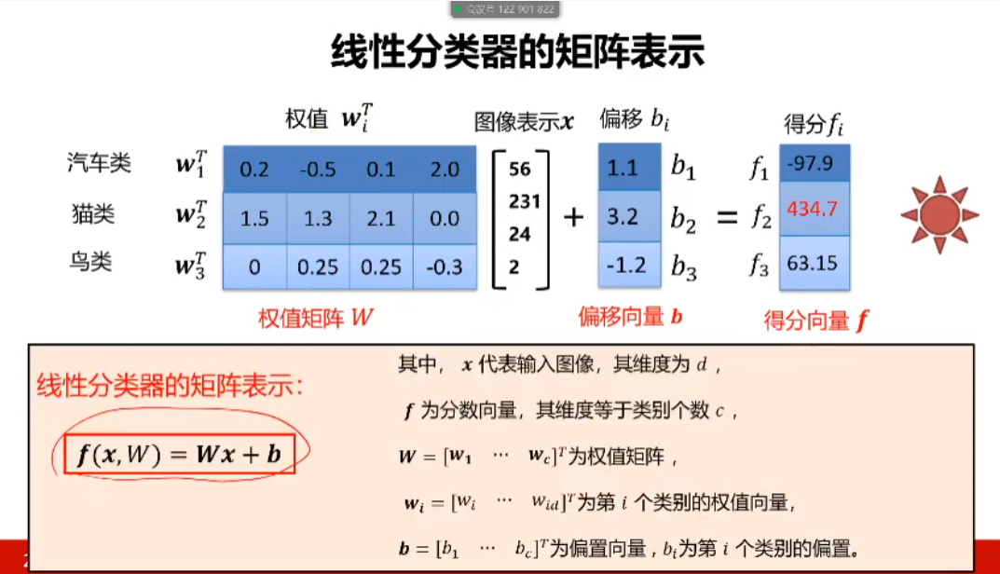
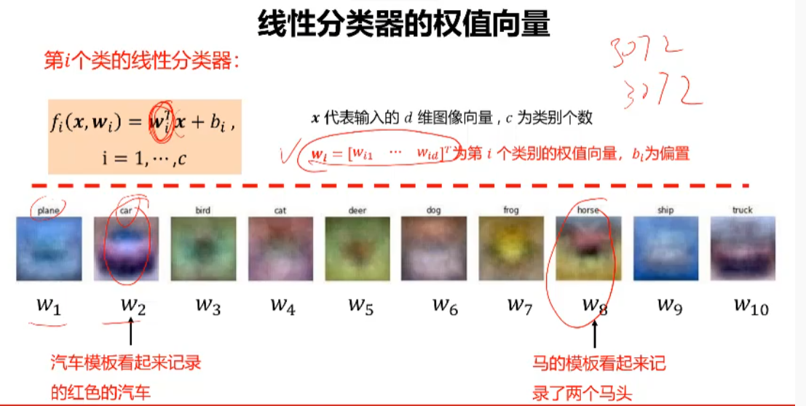
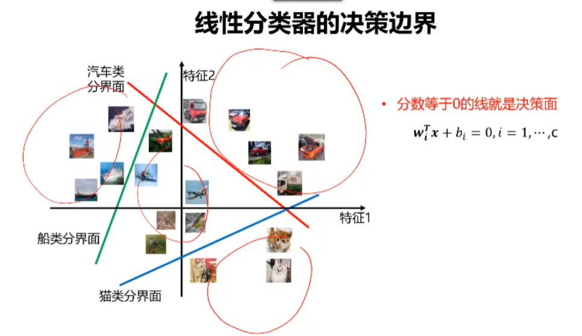

### 机器视觉 Chapter 2.2 线性分类器

https://www.youtube.com/watch?v=sRi7upFgFW4&list=PLFI1Cd4723_RQ6tTu-c2ZFFrMxtSIhztC&index=4

#### 本章内容

- 数据集	CIFAR10数据集，5000张样本，10000张测试样本，10个类别，尺寸32*32
- 分类器设计
  - 图像表示1
    - [x] 基于像素的图像表示
  - 分类模型3
    - [x] 线性分类器的定义
    - [x] 线性分类器的权值
    - [x] 线性分类器的分界面
  - 损失函数3下一节课开始
    - 损失函数的定义
    - 多类支持向量机损失
    - 正则项与超参数
  - 优化算法2
    - 什么是优化
    - 梯度下降算法，随机梯度下降算法以及小批量梯度下降算法
  - 训练过程2
    - 数据集划分
    - 数据预处理

----------------------------

#### 图像表示

图像分类

1. 二级制图像，黑和白

2. 灰度图像，1个像素1个字节。0-255

3. 彩色图像，一个像素3个字节，（R，G，B）

   

大多数分类算法都要求输入向量。图像表示成向量的方法，方法很多

1. 全局特征提取
2. 【本课程】采用最简单 X = [R1, G1, B1,.........Rn, Gb, Bn]

CIFAR10图像彩色，32*32，向量就是

​	长度：32 * 32 * 3 = 3072

维度 就是3072 *1

#### 为什么从线性分类器开始

原因有二

- 形式简单，易于理解
- 通过层级结构（神经网络）或者高维映射（支持向量机）可以形成功能强大的非线性模型。线性分类器是神经网络的基础，也是支撑向量机的基础

对于小批量样本，支撑向量机是绝对的王者之一

在大样本下，神经网络是绝对的王者之翼

#### 线性分类器定义

线性分类器是一种线性映射，把输入X图像（3072 * 1）转换成对应的标签

x代表输入d维(3072)的的图像向量，c为类别(10)个数

$f_i(x, w_j) = w_i^T x + b_i$               x是行向量，$w_i^T$是列向量。x和$w_i$长度相等

$i = 1,.....,c$

$w_i = [w_{i1},.......,w_{id}]^T$		第i类别的权值向量，$b_i为偏量$

决策规则

if $f_i(x) > f_j(x)$ ,	$\forall j  \neq i $ , 则决策输入图像x属于第i类

例子

假设我们有三个类别标签：汽车类，猫类，鸟类

线性分类器 $w_i^Tx + b_i = f_i,i = 1,2,3$		？求解

假设图像只有四个像素 x =[56, 231, 24, 2]

类别权值矩阵

计算步骤：

- 图像表示成向量x
- 计算当前图片每个类别的分数

$f_2$分数最高，因此我们判定当前图片x是猫类

|             | 权值$w_i^T$ |      |      |      | 图像表示x |      | 偏移$b_i$ |      | 得分$f_i$ |
| ----------- | ----------- | ---- | ---- | ---- | --------- | ---- | --------- | ---- | --------- |
| 汽车$w_1^T$ | 0.2         | -0.5 | 0.1  | 2.0  | 25        |      | 1.1       |      | -97.9     |
| 猫$w_2^T$   | 1.5         | 1.3  | 2.1  | 0.0  | 231       | +    | 3.2       | =    | 434.7     |
| 鸟$w_3^T$   | 0           | 0.25 | 0.25 | -0.3 | 24        |      | -1.2      |      | 63.15     |
|             |             |      |      |      | 2         |      |           |      |           |

矩阵$w_i$的行数由类别数量决定，列数和图片向量长度相同

因此线性分类器的矩阵表示就是

$f(x, W) = Wx + b$

- x: 输入图像，维度为d
- f: 分数向量，维度等于类别个数c
- W = $[w_i,....w_c]^T$  为权值矩阵，列数由输入图像维度决定
- $w_i = [w_{i1},.....w_{id}]$, 第i类别的权值向量
- $b = [b_1,.....b_c]^T$ 偏置向量，$b_i$为第i各类别的偏置

问题：CIFAR10数据，wvb的维度输多少？

CIFAR10书是32 * 32 * 3, 10个标签因此

- x是图像向量： 长度32 * 32 * 3 = 3072, 即 d = 3072
- 因此，$w_i$列数 = d = 3072
- 10个标签，所以c = 10， 因此W行数 = 10

因此

- w 维度 是 10 * 3072 
- x维度 3072 * 1
- b维度 10 * 1
- $f_i$维度10 * 1

接下来我们深入理解下线性分类器

#### 线性分类器的权值向量 - 从权值角度理解线性分类器

权值向量 $w_i = [w_{i1},......w_{id}]$ 

表示一个类别的特征向量

在上面例子中，我们的$w_i$维度是3072。图像也是3072 = 32 * 32 * 3

我们可以将$w_i$还原成 32 * 32 * 3的像素单元，下面我们看下10个类别的特征向量展示出来的效果图。

$w_2$中我们隐约还能看出他是一个车

关键

- 权值看作是一种模板

- 输入图像与评估模板匹配器度越高，分类器输出的分数就越高

#### 线性分类器的决策便捷 - 从几何层面来理解线性分类器

几何角度讲，分类器的本质就是求解决策便捷

- 分类等于0的线就是决策面
  - $w_i^Tx + b_i = 0$,		 i=1,.....c
- w控制着线的方向
- b控制着线的偏移
- 图中箭头方向代表分类器的正方向，沿着箭头方向距离决策面越远分数就越高

问题：他喵的如果计算结果在三条线之间意味着什么。。。？？

​	落在中间区域意味着，这个物体是猫类，鸟类，车的概率都很小

我们机器学习就是在学习w矩阵和b向量

---------------------------------------------

