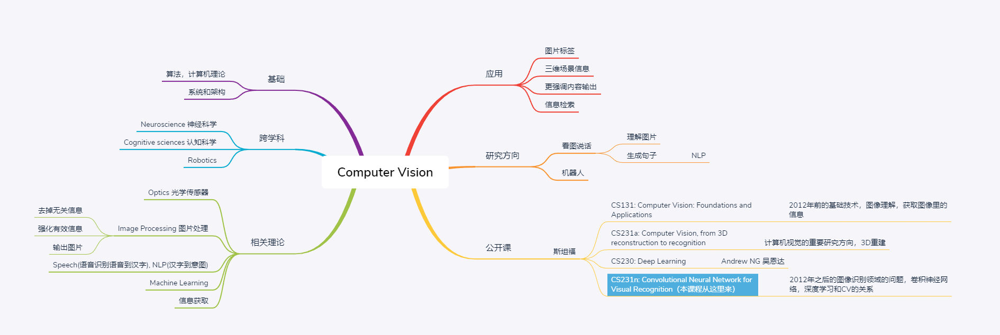
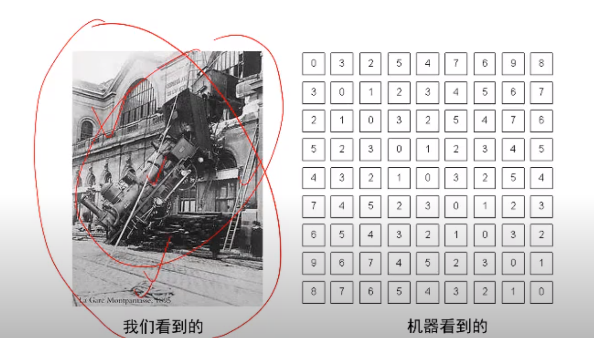
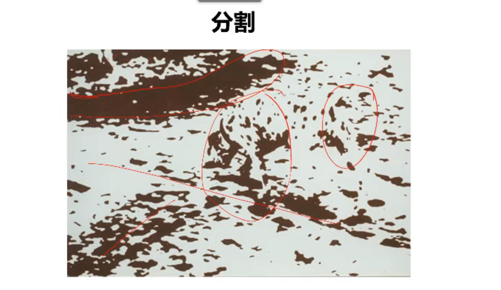
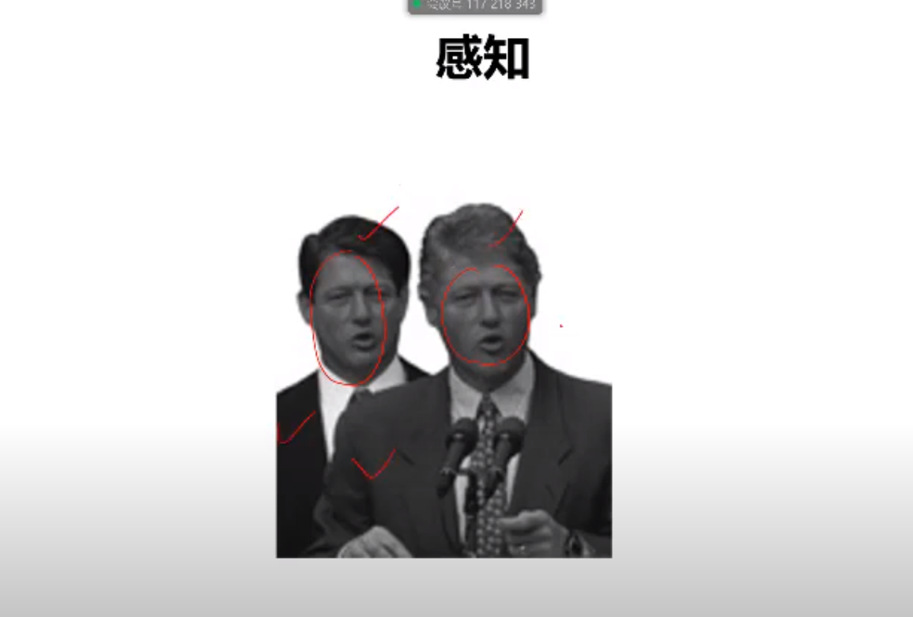
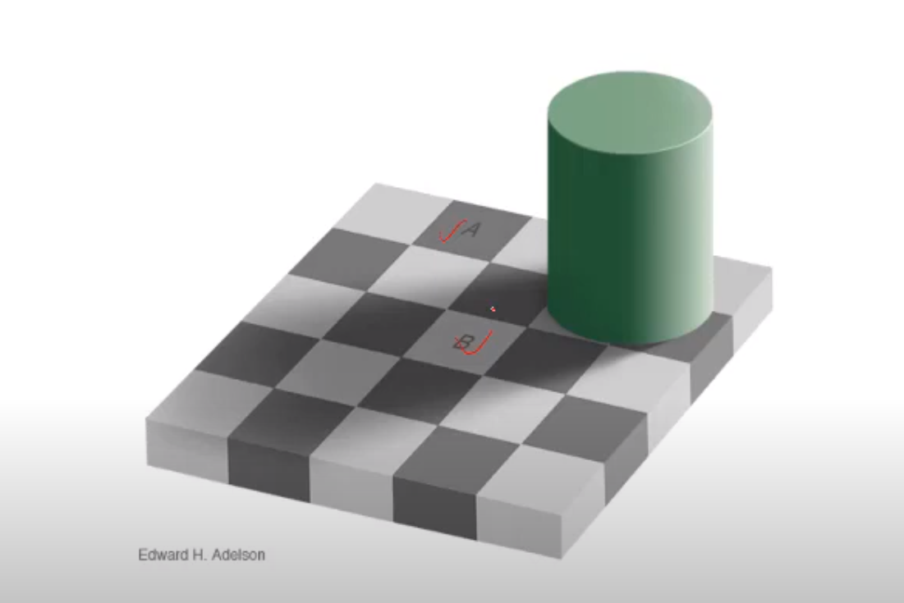
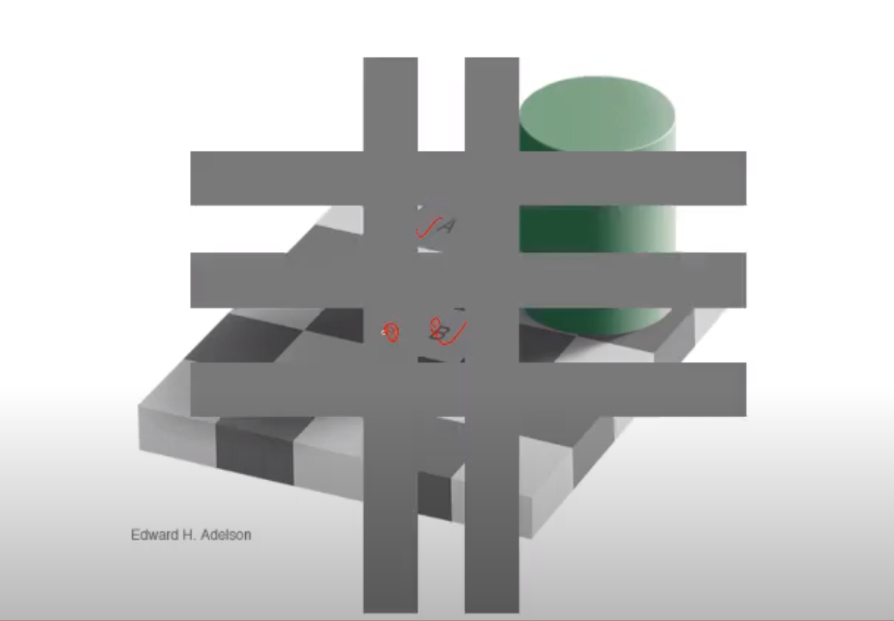
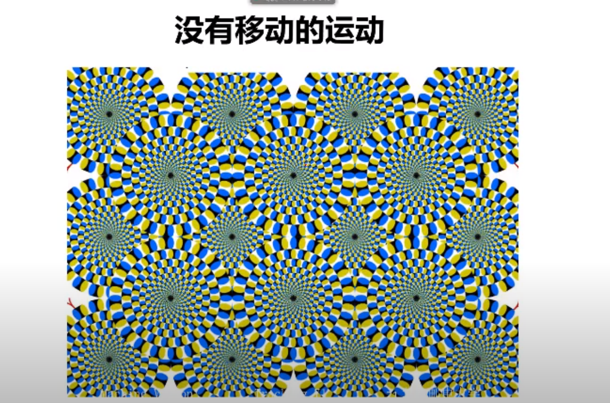

### 机器视觉 Chapter 1.1 课程背景和介绍

https://www.youtube.com/watch?v=YkVckrzNpSY&list=PLFI1Cd4723_RQ6tTu-c2ZFFrMxtSIhztC

#### 概述

#### 机器智能的思考

- 机器方法和人类方法相差巨大

- 有限条件内做了一些搜索而已

#### 什么是计算视觉

- 人类的视觉
  - 图片或视频 -> 感知设备: 眼睛 -> 解释器: 大脑  ->  结果
- 计算机的视觉
  - 图片或视频 -> 感知设备: 摄像头 -> 解释器: 计算机算法  ->  结果

- 计算视觉的目标

  

  人类

  ​	看到： 图中有火车，有建筑

  ​	理解图片表达的信息：可能是一个灾难

  计算机

  ​	一个数据矩阵

  ​	我们需要获取图像中的组成元素

  ​	根据元素推导出图片表达的信息

  

  因此，计算视觉的目标是 跨越语义鸿沟，建立像素到语义的映射

  

- 难度很大，假设图片是400*300像素灰度图，

  灰度图1个点1byte，0-255。则这张图片有12万个点，12w byte。

  我们需要从12w个点中推到出所有的组成元素或者说基本概念，从而进一步的理解这张图在表达什么

  从数学信号到予以语义的映射

#### 人类视觉研究

人类可以快速判断图片中是否有动物，150ms即可决策，在连续判断中准确率可达97%

高效的代价1：运动视盲

​	人类观察事物时候，对主体高度关注，对不那么重要的信息不关注

​	找茬游戏的起源

高效的代价2：图像分割

​	下面这张图不同的人会看出不同的效果，有些人会看出牛，狗

高效的代价3：感知

​	感知系统会认为下图是两个不同的人，但是仔细看，会发现都是克林顿

高效的代价4： 眼见未必为真。视觉系统BUG，更好的区分

下图中A和B位置颜色是否一样，乍一看是不一样的，但是我们把其他区域遮住再看，就会发现A和B是一样的颜色

高效的代价5： 图片看起来在动，但这是一张静态图

#### 人类的研究

我们看到鸟会飞，于是试图制造飞机，但实际上我们的飞机并不像鸟那样靠着扇动翅膀来飞翔

