### 机器视觉 Chapter 1.2 什么是机器视觉

https://www.youtube.com/watch?v=8LUG1sgKSSo&list=PLFI1Cd4723_RQ6tTu-c2ZFFrMxtSIhztC&index=2

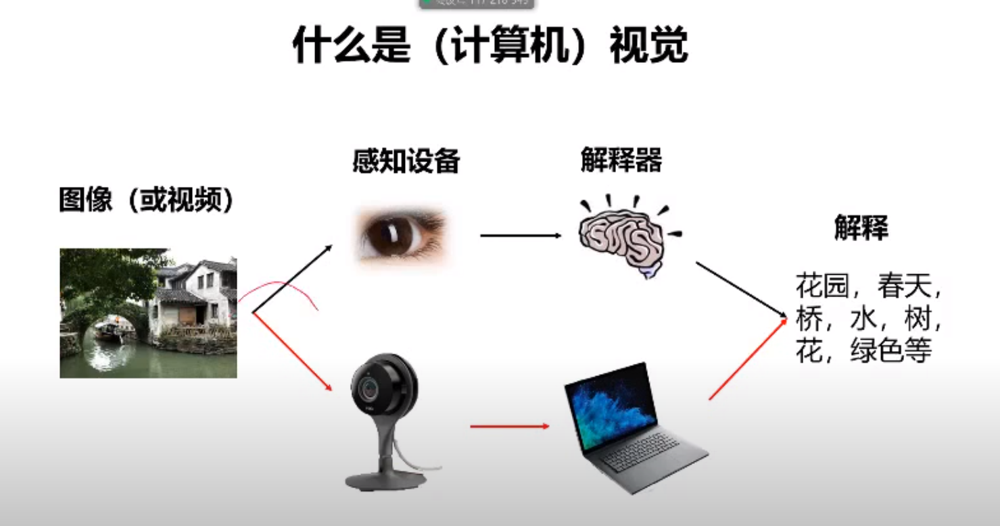

#### 机器视觉的研究历史

- 奠基人：Larry Roberts, 1963年博士论文，积木世界。

  从图像中恢复三维实体

  后来Larry没做机器视觉，而是去搞互联网，成了互联网之父。。。。就离谱

  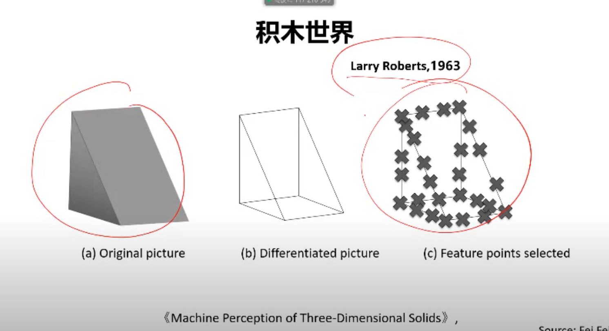

  

- 起源：1966年，MIT教授明斯基（第一个图灵奖人工智能得主1969年），给本科生的一个项目。架一台摄像机，把摄像机看到的东西描述出来，结果没搞定

  没有指导思想，没有研究方法，于是计算机视觉从图像处理学科中分离出来

- 先驱：David Marr (大卫马尔),  1945-1980

  马尔奖 Marr Prize，计算机视觉国际会议(ICCV international conference on computer vision)委员会颁发的计算机视觉领域重要奖项，计算视觉最高荣誉

  顶级会议：ICCV, CVVP

  贡献: 将问题研究分为三个分层

  - 计算理论，计算的目的是社么，该问题的已知或者可以施加的约束是什么
  - 表达和算法(最难的)：输入输出换个中间信息是如何表达的？使用哪些算法来计算所期望的结果？
  - 硬件实现: 表达和算法是如何映射到师级硬件即生物视觉系统或者特殊硅片上的？相反，硬件的约束怎样才能用于知道表达和算法的选择？随着计算视觉中使用图形芯片和多核心结构日益增长，这个问题再次变动相当重要转换成矩阵交给gpu处理可以提升性能

  

  表达分为三个阶段

  - 输入图像
  - 边缘图，提取简单的边缘
  - 理解边缘为2.5D简图，实际上现在并没有这一步
  - 从简图到3d模型

  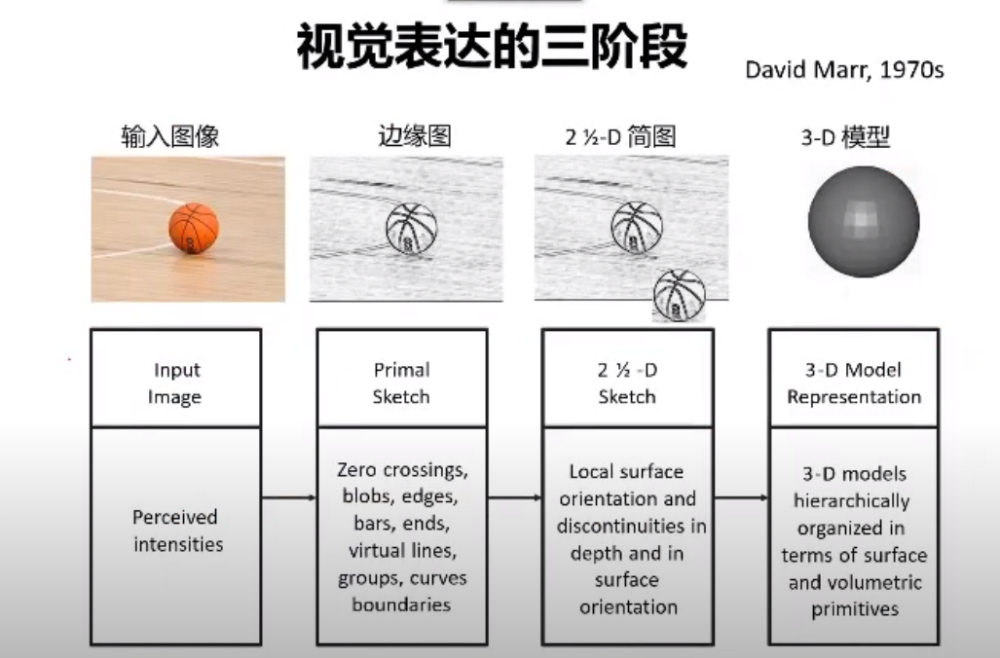

  

- 计算机视觉的目标

  跨越语义鸿沟，建立像素到语义的映射

- 图片中哪些信息需要理解？两个研究方向
  - 图像的3维场景结构信息

  - 理解语义信息

    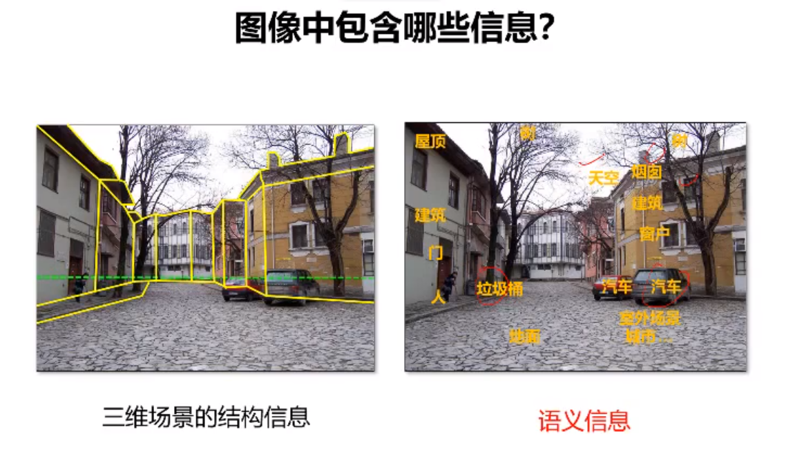

  

- 研究主题

  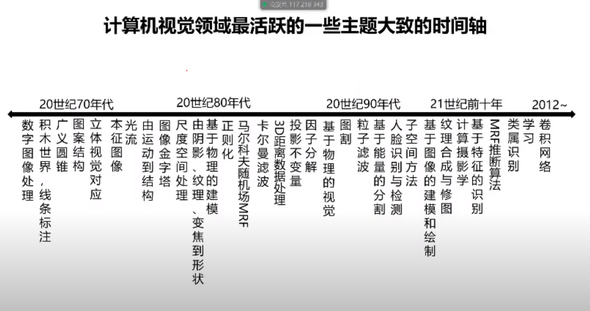

#### 计算视觉应用

- 动画产业，人脸复制，捕捉人脸用面具替换

  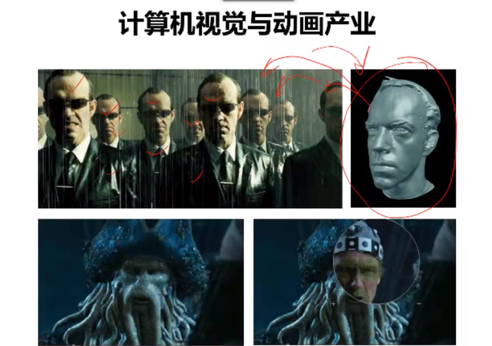

- 三维建模

  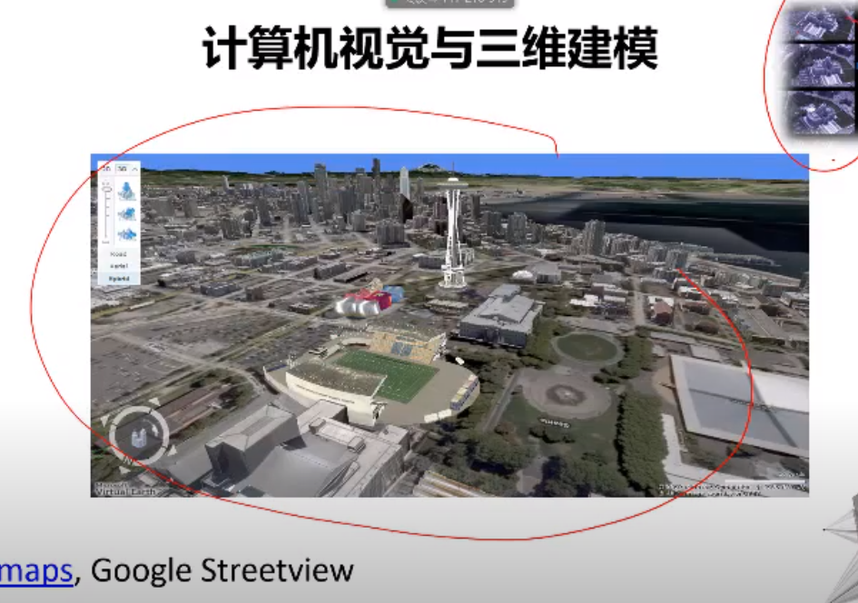

  

- 摄影行业，笑脸识别，面部识别

  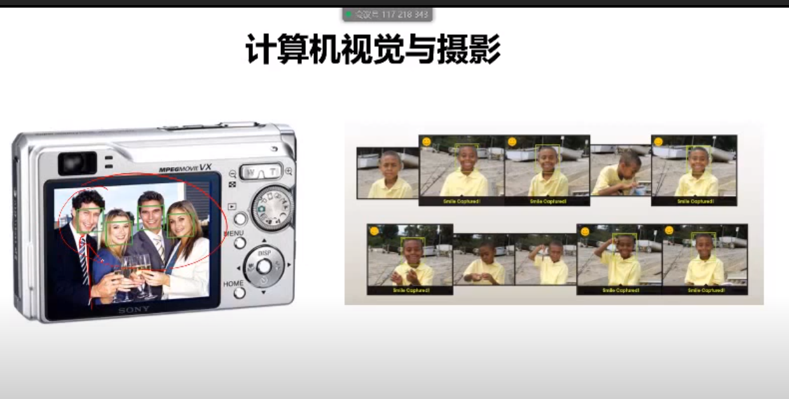

- 生物识别，

  - 虹膜识别，人脸识别

  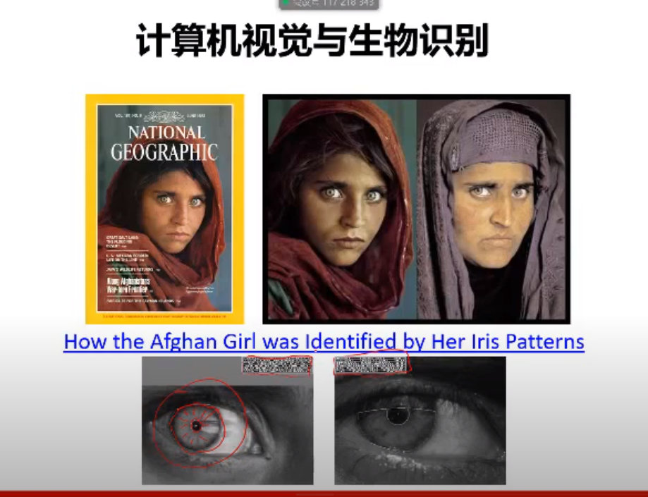

  - 指纹识别，人脸识别

- 光学字符识别 OCR

  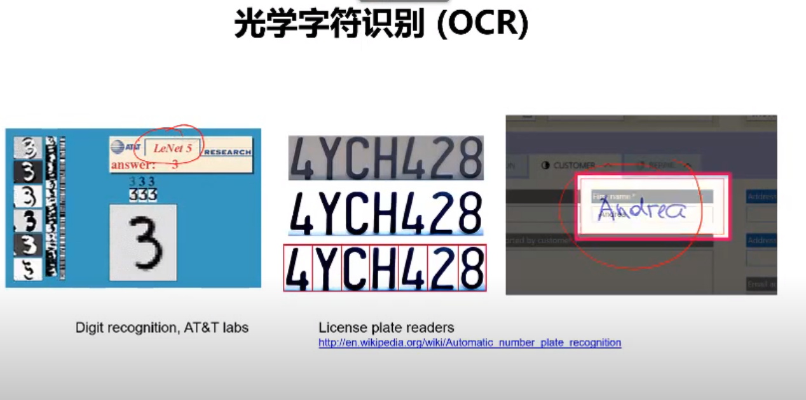

- google街景门牌号识别，可搜索

  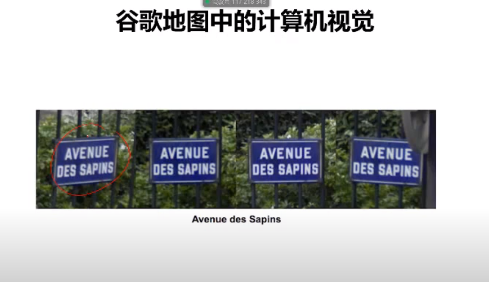

- 扫地机器人，3D场景地图构建，基于场景构建，定位来规划路径

  - 无重复，无漏扫，高效扫地

- 视觉搜索

  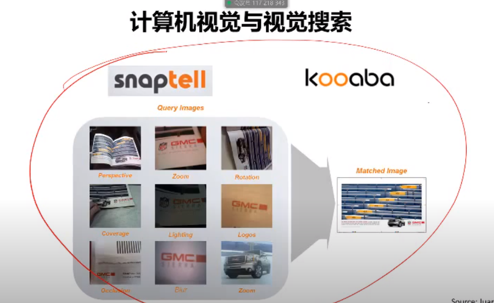

- 服装行业

  穿什么衣服，衣服如何搭配

  

  

- 穿戴设备，AR辅助显示场景

  - 映射现实世界和虚拟场景

    

- 自动驾驶和无人驾驶应用

  - 特斯拉用的就是视觉

  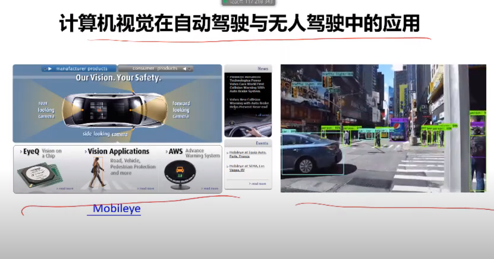

- 新零售，识别商品，自动结算

- 人机交互

  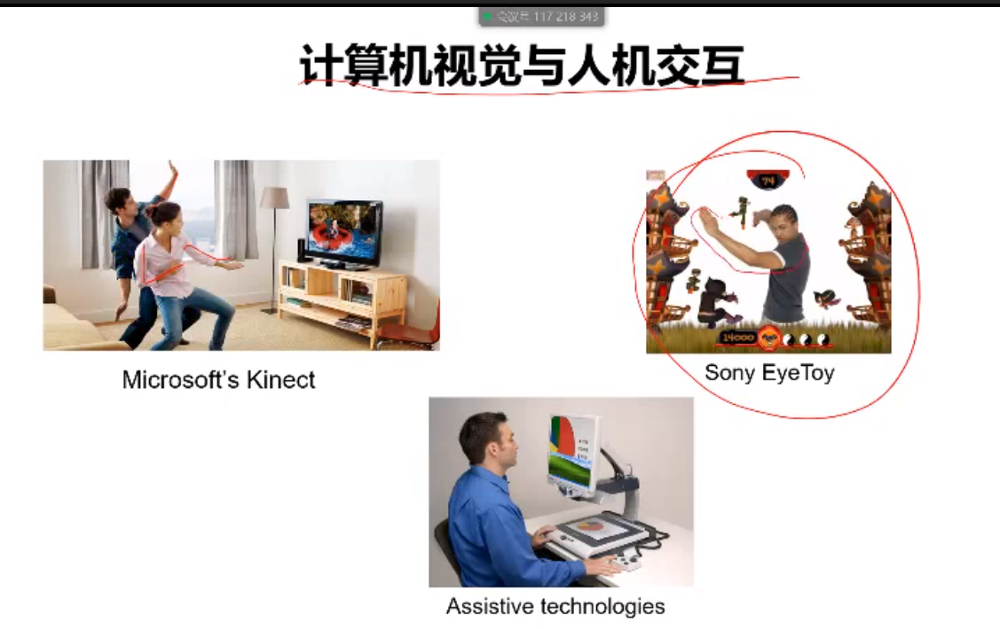

  

- 太空探索应用

  

- 医学图像

  

- 气象学应用，根据天空照片来分析天气

#### 课程介绍

本课程聚焦图像分类任务相关，以及相关任务

- 目标分类，图片里面是什么，猫，狗，猪
- 目标检测，猫在图片中什么位置
- 图像分割，哪些像素属于猫，哪些像素不属于
- 图像描述，给一张图片，生成一段描述
- 图像生成，无中生有，换脸

最有效的工具：卷积神经网络

为什么最有效？Large Scale Visual Recognition Challenge中

1000类别对象，1431167（百万级）图片

如何衡量结果正确：给出5个答案，只要有一个正确，就认为结果正确

这个测试下，机器已经超越人类5.1的成绩

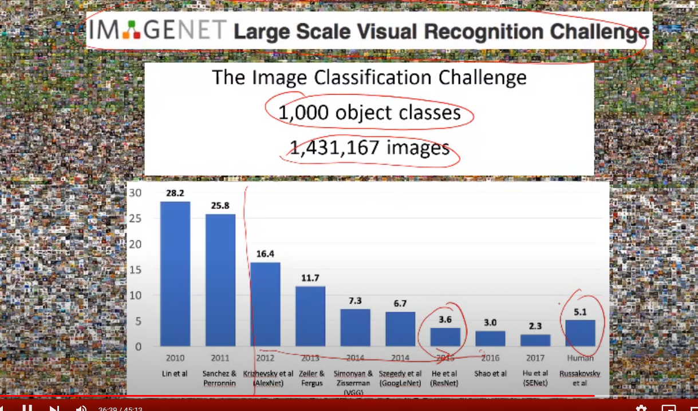

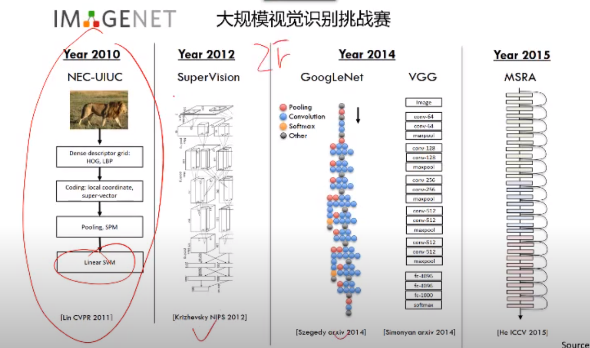

2012年以后，数据量暴增，传统方法无法应对，卷积神经网络可以满足需求

#### 深度学习三要素以及代表人物

- 算法，2018年图灵奖，三位大神

- 数据，image net, 李菲菲

- 算力，NVIDIA创始人，老黄

#### 课程目标

- 了解视觉识别任务和难点
- 掌握多种典型的视觉识别任务，分类，检测，分割等
- 熟悉机器学习的一些基本概念，了解机器学习系统的设计流程
- 掌握多种深度网络结构，全连接神经网络，卷积神经网络，循环神经网络，变分自编码网络，生成对抗网络等

#### 章节安排

围绕五个任务

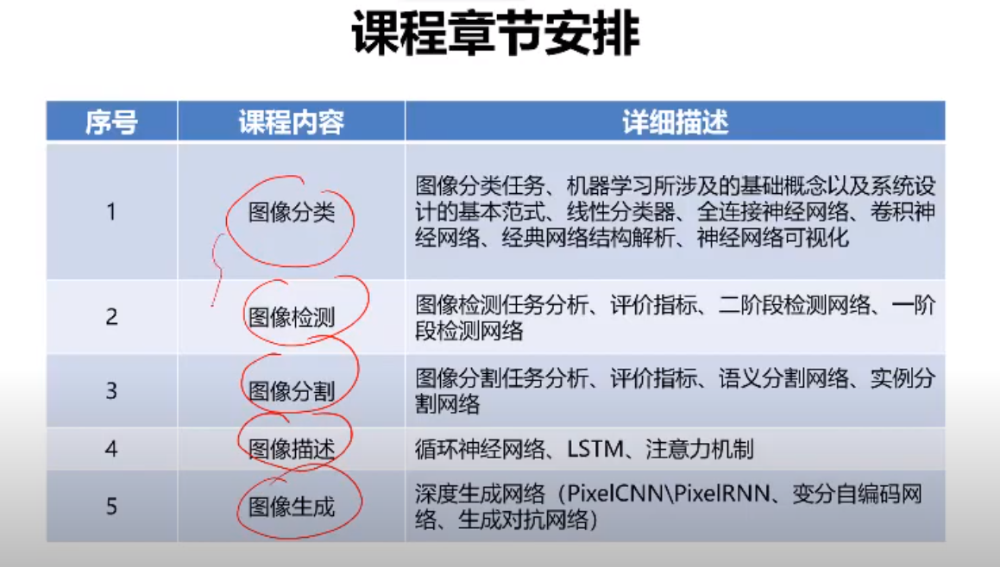