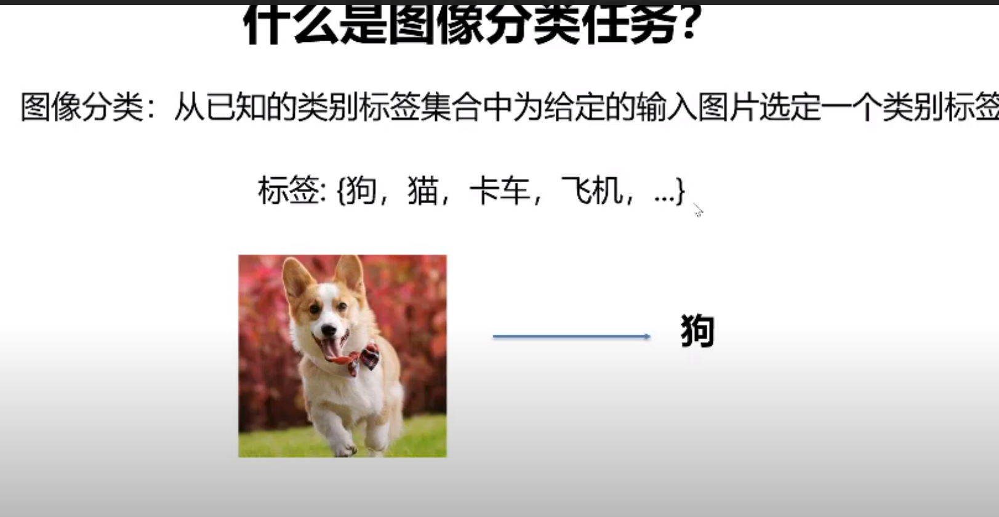
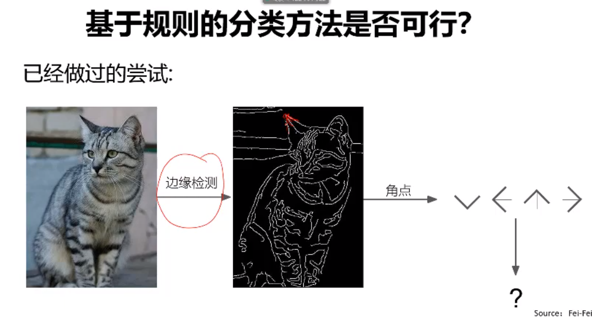
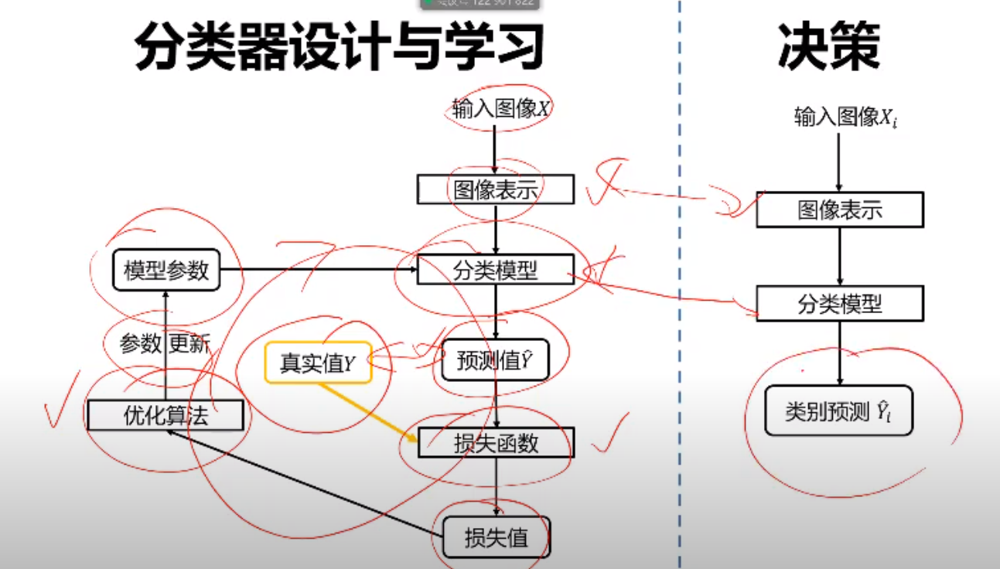

### 机器视觉 Chapter 2.1 图像分类

https://www.youtube.com/watch?v=UsHp5MydxZE&list=PLFI1Cd4723_RQ6tTu-c2ZFFrMxtSIhztC&index=3


#### 图像分类任务

- 什么是图像分类任务，有哪些应用
- 图像分类任务有哪些难点
- 基于规则的方法是否可行
- 数据驱动的图像分类范式
- 常用的分类任务评价指标是什么


#### 什么是图像分类任务

图像分类任务是计算机视觉中的核心人物，目标是根据图像信息中所反应的不同特征，把不同类别的图像区分开


从已知的类别标签集合中为给定的输入图片选定一个类别标签




#### 应用场景

- 通过视觉方式获得信息
  - 识别花的种类，拍个照片，在互联网上搜索即可获得物体信息
  - 识别动物的种类，狗的品种，历史


#### 关键问题难点

- 视角：不同视角像素特征差异巨大，换个视角特征就不适用了

  - 训练时候就要考虑到视角

- 光照：不同光照条件下，特征也会不一样

- 尺度：同一个人，图片尺寸不一样，特征也会不一样

- 遮挡：猫头上盖着布

- 形变：猫有各种动作，坐着，躺着，站着。。。。。动物形变特别多。深度学习可以解决这个问题

- 背景杂波：有些东西和背景颜色非常相近，比如白色的狗在雪地中

- 类内形变：凳子的形态各式各样

- 运动模糊：来自成像器件

  - 如何产生运动模糊？曝光时间，假设拍一张照片需要1秒，鸟一直在动，因此同一个像素会出现在多个位置上
  - 解决方法：
    - 硬件：高速摄像机，超级昂贵
    - 算法：掌握运动规律，运动模糊中恢复出原图

- 类别繁多：人大约认识1w-3w个物品

  - 我们希望计算视觉也能认识这么多物品
  - 然而，要识别的物品越多，分类器出错就越多，制作这种话系统越难

  

  

  因此，具体任务决定了我们要怎么做！！！我们不需要直接面对上面所有的难点

  假设我要识别客户赛的一张钞票是多少钱，那么我们就可以加一个摄像机垂直对着传送带，纸币经过我就知道是多少钱。在这种场景下，摄像机和纸币的位置关系是确定的，光照也是确定的，唯一问题就是摄像机和纸币水平方向可能有小的位移。问题变得简单了

  

  特定场景下，都有特定的解决办法，灵活调整即可


#### [不可行] 基于规则的方法是否可行

通过硬编码的方法识别猫或者其他类

```python
def classify_image(image):
    // do something magical here 
	return class_label
```


已经做过的尝试

通过硬编码非常困难，因为我们需要穷举猫的各种形态，而猫的形变非常复杂，我们做不到




#### [流行] 什么是数据驱动的图像分类范式

Machine Learning


数据驱动的图像分类方法

1. 数据集构建，数据集带有标签，有监督学习
   - 【本课程专注有监督】有监督学习任务，因为数据集自己带标签
   - 无监督学习任务，数据集自己不带标签，更多希望从数据资深找一些规律
2. 分类器设计与学习
   - 设计，找一个数学模型，从数据中归纳规律
   - 学习，把数学模型中的参数算出来
3. 分类器决策
   - 图像分类


#### 分类器设计与学习




- 输入图像需要转换为图像表示，即模型可以接受的输入

- 通过分类模型，得到一个预测值

- 损失函数得到真实值

- 损失值则是差异

- 通过优化算法来降低损失值

  

1. 图像表示

   - <font color="red">[本课程重点]</font> 像素表示，300*300，就有9w个像素点
   - 全局特征表示 (比如 GIST)
     - 从图像中抽取全局特征，适合风景，室内场景；不适用与猫狗细节，因为总会出现遮挡
   - 局部特征表示 (比如，SIFT, 特征+词袋模型)
     - 从场景中抽取若干个区块，提取一个包含区块特征的特征集合

2. 分类器模型：<font color="pink">学习机器学习的关键就是要搞清楚每个分类器的<font color="red">强项</font>，<font color="red">弱项</font>,<font color="red">原理</font></font>

   - 近邻分类器
   - 贝叶斯分类器
   - <font color="red">[本课程重点]</font>线性分类器
   - 支撑向量机分类器，线性分类器的一个扩展
   - <font color="red">[本课程重点]</font>神经网络分类器
   - 随机森林
     - 决策树
   - adaboost

3. 损失函数，真实值和预测值之间的差异

   - 0-1损失
   - 多类支持向量机损失
   - 交叉熵损失
   - L1损失
   - L2损失

4. 优化算法, 迭代优化

   - 一阶方法
     - <font color="red">[本课程重点]</font>梯度下降
     - <font color="red">[本课程重点]</font>随机梯度下降
     - <font color="red">[本课程重点]</font>小批量随机梯度下降
   - 二阶方法
     - <font color="red">[本课程重点]</font>牛顿法
     - BFGS
     - L-BFGS

5. 训练过程

   - 数据集划分

   - 数据预处理，是否要做预处理

   - 数据增强，样本不够让数据集变得更多，让分类器从各种视角去看样本数据，

     - 具体方法很多

   - 欠拟合与过拟合，训练过程中会出现的现象。欠拟合：训练集怎么样都不行；过拟合：测试数据集准确率99.5%，实际应用25%；

     - 减小算法复杂度
     - 使用权重正则项
     - 使用droput正则化

   - 超参数调整，模型设计时候需要解决的参数

   - 模型集成：能否使用多个模型，让系统性能变得更好

     

#### 常用的分类任务评价指标是什么


正确率(accuracy)：= 分对的样本数 / 全部样本数

错误率(error rate)：= 1 - 正确率


TOP 1 指标 与 TOP 5指标

- TOP 1指标只参考第一个标签，准确就认为对，否则认为挫

- TOP 5指标参考所有5个结果标签，只要有一个是对的，就认为预测结果正确


#### 重点

<font color="pink">学习机器学习的关键就是要搞清楚每个分类器的<font color="red">强项</font>，<font color="red">弱项</font>,<font color="red">原理</font></font>
